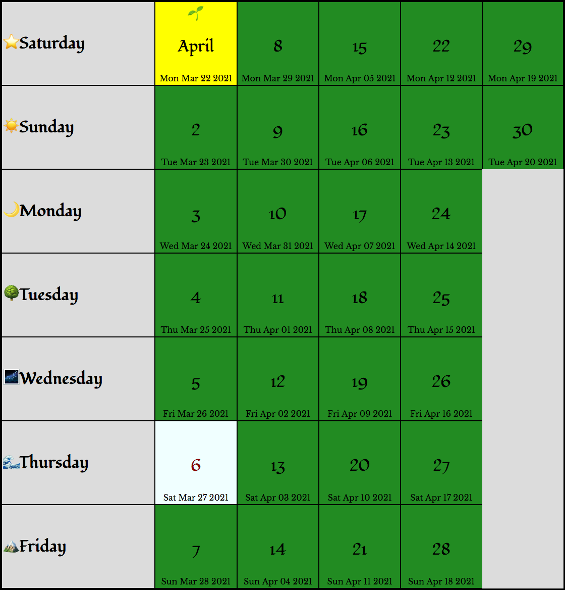

Shire Reckoning
===============

> The months and days, therefore, throughout The Lord of the Rings refer to the Shire Calendar.
>
> ... Mid-year's Day was intended to correspond as nearly as possible to the summer solstice.
> In that case the Shire dates were actually in advance of ours by some ten days...
>
> -- J.R.R. Tolkien, *The Lord of the Rings* Appendix D

# Contents

* [Tolkien's Calendars](#tolkiens-calendars)
* [Introduction](#introduction)
* [Middle-earth Simulation](#middle-earth-simulation)
* [Middle-earth Holidays](#middle-earth-holidays)
    * [New Year's Eve and New Year's Day](#new-years-eve-and-new-years-day)
    * [Middle-days and Leap-days](#middle-days-and-leap-days)
    * [Unique Holidays](#unique-holidays)
        * [Fourth Age Holidays](#fourth-age-holidays)
* [Synchronization Settings](#synchronization-settings)
    * [Shire and Gondor Calendar Synchronization Settings](#shire-and-gondor-calendar-synchronization-settings)
        * [Synchronize Mid-year's Day with the modern summer solstice.](#synchronize-mid-years-day-with-the-modern-summer-solstice)
        * [Synchronize Shire 'January' 9 with modern New Year's Day.](#synchronize-shire-january-9-with-modern-new-years-day)
        * [Synchronize Shire New Year's Day with modern Christmas Day.](#synchronize-shire-new-years-day-with-modern-christmas-day)
        * [Synchronize Mid-year's Day with Southern Hemisphere summer solstice.](#synchronize-mid-years-day-with-southern-hemisphere-summer-solstice)
    * [Rivendell Calendar Synchronization Settings](#rivendell-calendar-synchronization-settings)
        * [Synchronize Enderi with "Hobbit Day"](#synchronize-enderi-with-hobbit-day)
        * [Synchronize Yestarë with modern March 25](#synchronize-yestarë-with-modern-march-25)
        * [Synchronize Yestarë with Shire 'April' 6, "more or less"](#synchronize-yestarë-with-shire-april-6-more-or-less)
        * [Synchronize with Boris Shapiro's "7th Age" Reckoning](#synchronize-with-boris-shapiros-7th-age-reckoning)
        * [Synchronize Enderi with March 25](#synchronize-enderi-with-march-25)
* [Shire Reckoning Notes](#shire-reckoning-notes)
    * [Shire Weekdays](#shire-weekdays)
    * [Shire Months](#shire-months)
    * [Shire Holidays](#shire-holidays)
    * [Shire-reform](#shire-reform)
    * [Reckoning start dates](#reckoning-start-dates)
        * [Shire, Gondor, and Gregorian intercalation differences](#shire-gondor-and-gregorian-intercalation-differences)
        * [Adopting Shire Reckoning to modern times](#adopting-shire-reckoning-to-modern-times)
        * [Reckoning with moon phases](#reckoning-with-moon-phases)
            * [The Lord of the Rings Lunar Readalong](#the-lord-of-the-rings-lunar-readalong)
        * [What if our years began at the same seasonal point?](#what-if-our-years-began-at-the-same-seasonal-point)
* [Gondor Reckoning Notes](#gondor-reckoning-notes)
    * [Gondor Weekdays](#gondor-weekdays)
    * [Gondor Months](#gondor-months)
    * [Gondor Holidays](#gondor-holidays)
* [Rivendell Reckoning Notes](#rivendell-reckoning-notes)
    * [Rivendell Weekdays](#rivendell-weekdays)
    * [Rivendell Seasons](#rivendell-seasons)
    * [Rivendell Holidays](#rivendell-holidays)
    * [Aligning the Calendar of Imladris to the Gregorian calendar](#aligning-the-calendar-of-imladris-to-the-gregorian-calendar)
    * [The Drifting of the Calendar of Imladris through Time](#the-drifting-of-the-calendar-of-imladris-through-time)
    * [Why March 22nd?](#why-march-22nd)
        * [Why not March 29th?](#why-not-march-29th)
        * [Rivendell New Year's Day fell on a March 25th by the end of the Third Age](#rivendell-new-years-day-fell-on-a-march-25th-by-the-end-of-the-third-age)
    * [Reformed Rivendell Reckoning rules](#reformed-rivendell-reckoning)
        * [Why March 25th?](#why-march-25th)
        * For a general reference for converting a date in the Gregorian calendar, in any year,
          to a date in the Rivendell Reckoning calendar, I recommend using my "Reformed" rules
          (and choosing a non-leap-year for dates between February 28 and Rivendell New Year's Day).
* [References](#references)
* [Shire Reckoning for Other Calendar Apps](#shire-reckoning-for-other-calendar-apps-shire-reckoningics)
* [License](#license)

# Tolkien's Calendars

The calendars described in *The Lord of the Rings* [Appendix D](https://tolkiengateway.net/wiki/Appendix_D) are
the [Shire Reckoning](#shire-reckoning-notes) of the Hobbits,
the [Rivendell Reckoning](#rivendell-reckoning-notes) of the Elves,
and the 3 calendars of Gondor:
[Kings' Reckoning, Stewards' Reckoning, and the New Reckoning](#gondor-reckoning-notes).

[Follow this link for a live demonstration of these calendars](https://psarando.github.io/shire-reckoning/#tolkiens-calendars).

The following screenshot demonstrates the Shire month of 'April' generated by this project.

More examples of each calendar can be found in the
[examples directory](https://psarando.github.io/shire-reckoning/examples/),
along with installation and usage instructions,
including [instructions for adding these calendars to your own site or app](https://psarando.github.io/shire-reckoning/examples/)!

* [Shire Calendar examples](https://psarando.github.io/shire-reckoning/examples/?path=/story/shire-reckoning-shire-calendar-year-view--comparing-all-region-names)
* [Rivendell Calendar examples](https://psarando.github.io/shire-reckoning/examples/?path=/story/shire-reckoning-rivendell-calendar-possible-historic-calendars--for-select-years-in-middle-earth-history)
* [Gondor Calendar examples](https://psarando.github.io/shire-reckoning/examples/?path=/story/shire-reckoning-gondor-calendar-year-view--comparing-all-reckonings)
* [Shire iCalendar and base reckoning function examples](https://psarando.github.io/shire-reckoning/examples/?path=/story/shire-reckoning-shire-calendar--icalendar-creator-for-importing-into-your-calendar)
    * Shire Reckoning for Google Calendar, Apple's iCal, or other calendar apps!

[![[npm version]](https://img.shields.io/npm/v/shire-reckoning.svg?logo=npm)](https://www.npmjs.org/package/shire-reckoning)
[![[react dependency version]](https://img.shields.io/npm/dependency-version/shire-reckoning/peer/react.svg?logo=react)](https://reactjs.org)

## Introduction

Have you ever been confused to find the date of [February 30](https://tolkiengateway.net/wiki/30_February)
in the timeline of J.R.R. Tolkien's *The Lord of the Rings*?
Or have you ever tried reading about the Middle-earth calendars in *The Lord of the Rings*
[Appendix D](https://tolkiengateway.net/wiki/Appendix_D)
but became bogged down by all the leap-day details and *Deficit* calculations?

Or are you curious about how the calendars of Middle-earth compare to a modern-day calendar?
Or do you simply wish to
[find your birthday](https://psarando.github.io/shire-reckoning/#tolkien-calendars) according to the
[Shire Reckoning](#shire-reckoning-notes) of the Hobbits,
the Elvish [Reckoning of Rivendell](#rivendell-reckoning-notes),
or Aragorn the King Elessar's [New Reckoning](#gondor-reckoning-notes) of the Fourth Age?

Many fans of *The Lord of Rings* don't realize that [Middle-earth](https://tolkiengateway.net/wiki/Middle-earth#Inspiration)
is not meant to be in a parallel universe or on a fictional planet
like C.S. Lewis' [Narnia](https://en.wikipedia.org/wiki/Narnia_(world))
or George R.R. Martin's [Westeros](https://en.wikipedia.org/wiki/World_of_A_Song_of_Ice_and_Fire).
In [one of Tolkien's letters](https://tolkiengateway.net/wiki/Letter_165), he said
"'Middle-earth' by the way, is not a name of a never-never land without relation to the world we live in...
imaginatively this 'history' is supposed to take place in a period of the actual Old World of this planet."
Although there are many supernatural beings and events that occur in Middle-earth,
the laws of nature that apply to the real Earth should still apply to the world of Middle-earth
(at least by the [Third Age](https://tolkiengateway.net/wiki/Third_Age)),
which is why Tolkien put so much effort into ensuring things like distances traveled,
and the [phases of the Moon](#reckoning-with-moon-phases),
were as realistic as possible in *The Lord of Rings*.
As Tolkien put it [in another letter](https://tolkiengateway.net/wiki/Letter_210),
"The Lord of the Rings may be a 'fairy-story',
but it takes place in the Northern hemisphere of this earth:
miles are miles, days are days, and weather is weather."
So it also follows that years are years, seasons are seasons, and solstices are solstices;
and by observing the skies of our world, we're also observing the skies of the world of *The Lord of Rings*!
That is also why the Shire Calendar is so similar to the modern
[Gregorian calendar](https://en.wikipedia.org/wiki/Gregorian_calendar)
(the most widely used calendar in modern times),
and why they have [almost identical leap-year rules](#shire-gondor-and-gregorian-intercalation-differences).

The primary goal of this Shire Reckoning project is to visualize how the calendars described in
*The Lord of the Rings* [Appendix D](https://tolkiengateway.net/wiki/Appendix_D)
relate to the Gregorian calendar,
but the notes of this project also include some highlights of the lore found in Appendix D.

It's my hope that this project can serve as a reference for fans who are interested in the lore of Appendix D,
such as the [holidays celebrated in the Fourth Age](#middle-earth-holidays)
or how the Middle-earth calendars compare to each other,
but who don't want to get bogged down in details such as the *Deficit* calculations.
Although this project also includes detailed notes
for anyone who finds the [minutiae](https://psarando.github.io/shire-reckoning/Middle-earth-simulation.html#caveats-and-minutiae)
or [math behind the calendars of Middle-earth](https://psarando.github.io/shire-reckoning/Kings_Reckoning_Rules_and_Deficit.html)
interesting, plus I've added some of my own insights into the details of these calendars for those who wish to learn more.

I also find it easier to understand the layout of the calendars of Middle-earth visually,
rather than just relying on the text descriptions of Appendix D.
So I hope I can help some fans get more out of Appendix D with this project as a reference,
much like having the visual reference of the map of Middle-earth in the back of the book
which helps readers understand the different locations described in the story.

I also hope that this visual reference makes it easier to understand how these calendars worked
by comparing them to the Gregorian calendar that's already familiar to most of us.
So the default Shire Reckoning calendar is displayed according to the reasonable rules suggested by
[Shire-reckoning.com](http://shire-reckoning.com/calendar.html)
(not affiliated with this project),
where Shire [Mid-year's Day](#middle-days-and-leap-days)
is aligned as much as possible with the contemporary
[summer solstice](https://en.wikipedia.org/wiki/Solstice)
(which is [usually on June 21st](https://en.wikipedia.org/wiki/Summer_solstice#/media/File:Gregoriancalendarleap_solstice.svg)),
and it follows the same leap-day rules of the Gregorian calendar.
This allows it to stay in sync with the Gregorian calendar so that most Shire Reckoning dates
will always fall on the same Gregorian date.
The exception being in leap-years, when these calendars will temporarily shift out of sync by 1 day,
starting from the Gregorian leap-day of February 29 until the [Shire leap-day of Overlithe in midsummer](#middle-days-and-leap-days).
To see this for yourself in the default Shire Calendar on this project's home page,
[set the `Gregorian Date` to June 21 in a leap-year](https://psarando.github.io/shire-reckoning/#tolkien-calendars),
then change the year to a non-leap-year (2016 and 2017 for example).
It may be easier to see the differences by viewing the entire calendar year at once,
by selecting the `This Year` button at the top of the calendar.

Note that Tolkien stated in Appendix D that the Gondor calendars reckoned their dates from sunrise to sunrise,
and the Elves reckoned their dates from sunset to sunset,
but for simplicity, all the calendars of this project reckon their dates from midnight to midnight,
just as our modern Gregorian calendar and the [Shire Calendar reckon dates](https://psarando.github.io/shire-reckoning/Middle-earth-simulation.html#reckoning-the-start-or-end-of-a-day).

By default, these calendars make no attempt to correlate Gregorian years with Shire-reckoning years or the Ages of Middle-earth.

## Middle-earth Simulation

As pointed out in the [Shire Reckoning notes](#shire-gondor-and-gregorian-intercalation-differences),
the calendars of Gondor and the Shire described in Appendix D had similar
yet different leap-year and leap-day rules compared to our Gregorian calendar.
So this project also includes a way to reckon Shire and Gondor dates according to
the traditional leap-day and leap-year rules as described in Appendix D.
This allows me to implement a simulation that can display these calendars according to
Shire-reckoning years and the Ages of Middle-earth.
Various ways of synchronizing Gregorian years with Shire-reckoning years and the Ages of Middle-earth are also provided.

[Follow this link for a live demonstration of these simulations](https://psarando.github.io/shire-reckoning/Middle-earth-simulation.html).

Note that those who are only interested in a Shire, Gondor, or Rivendell date conversion for today's date in modern times
should simply use the [default calendars on this project's home page](#tolkien-calendars) as a reference.
For example, if you simply want to know how a Shire date listed on [Tolkien Gateway](https://tolkiengateway.net/wiki/Third_Age_3019)
would convert into a date in this year's calendar, use the [default Shire Calendar on this project's home page](#tolkien-calendars).
If you're more interested in how the different leap-day rules of Appendix D cause dates to shift in each of these calendars relative to each other,
or how these calendar rules would shift dates relative to the Gregorian calendar over thousands of years,
then you may be more interested in [the Middle-earth calendar simulations](https://psarando.github.io/shire-reckoning/Middle-earth-simulation.html).

## Middle-earth Holidays

If you've spent some time exploring these calendar visualizations,
then you may have noticed that each month is displayed with a color appropriate to that month's name or season,
but certain days are highlighted with a pale color (different than the yellow highlight marking today's date).

Those highlighted days are considered holidays in those calendars,
and most are also days that do not belong to any month.

### New Year's Eve and New Year's Day

In each calendar, New Year's Eve and New Year's Day are holidays.
In the [Shire Calendar](#shire-reckoning-notes) these are called "1 Yule" and "2 Yule",
but in all other calendars they are called *Mettarë* (Last Day) and *Yestarë* (First Day).

### Middle-days and Leap-days

Each calendar also has a set of special holidays in the middle of the year.
In the Shire Calendar these are "Mid-year's Day" in midsummer, surrounded by the Lithe days, "1 Lithe" and "2 Lithe";
and in leap-years a leap-day called "Overlithe" follows "Mid-year's Day".
In Bree these are known as *The Summerdays*, although it's unclear to me whether or not Bree also had a "Mid-year's Day",
or if that was simply the 2nd *Summerday*. This project displays a "Mid-year's Day" in both the Shire and Bree calendars.

In the [calendars of Gondor](#gondor-reckoning-notes), the "Mid-year's Day" in midsummer is called *Loëndë*,
and in leap-years that day is replaced by 2 *Enderi* (Middle-days),
except in Aragorn the King Elessar's [New Reckoning](#the-3-calendars-of-gondor),
where *Loëndë* is in autumn and Frodo's birthday is a holiday,
and his birthday celebration is doubled in leap-years by having the leap-day also on his birthday,
"called *Cormarë* or Ringday" (see the [New Reckoning](#the-3-calendars-of-gondor) notes for more details).

The [Calendar of Imladris](#rivendell-reckoning-notes) simply has 3 Enderi (Middle-days) in the middle of its year
(around the [autumnal equinox](http://en.wikipedia.org/wiki/Equinox)),
and those Enderi are doubled (adding 3 leap-days) every 12 years
(with rare exceptions, see the [Rivendell Reckoning Notes](#rivendell-reckoning-notes) for more details).

Note that Tolkien only specifically stated that New Year's Eve, New Year's Day, and the Middle-days ("Mid-year's Day" / Loëndë etc.)
were holidays in the Shire and [Stewards' Reckoning](#the-3-calendars-of-gondor) calendars,
and that in the Shire Calendar "the Overlithe was a day of special holiday",
but surely these common features in the other Middle-earth calendars would be considered holidays in those calendars as well.

### Unique Holidays

Tolkien also described the following holidays specific to certain calendars:

* During the Third Age, the [Stewards' Reckoning](#the-3-calendars-of-gondor)
  calendar had a 'Spring-day' (*Tuilérë*) and an 'Autum-day' (*Yáviérë*),
  which were holidays in Gondor in addition to holidays inherited from the [Kings' Reckoning](#the-3-calendars-of-gondor):
  *Loëndë* (Mid-year's Day), *Mettarë* (Last Day), and *Yestarë* (First Day).
  The *Tuilérë*, *Loëndë*, and *Yáviérë* holidays remind me of the
  [*Erukyermë*, *Erulaitalë*, and *Eruhantalë* holidays of Númenor](https://tolkiengateway.net/wiki/Three_Prayers).
* As mentioned above, the [Shire Calendar's](#shire-reckoning-notes) New Year's Eve and New Year's Day were called the Yule days,
  but Appendix D also says that the "Yule-tide" was 6 days in total,
  including the 2 days before and the 2 days after the Yule days.
* *The Silmarillion* mentions a festival of Gondolin in the First Age
  called the "[Gates of Summer](https://tolkiengateway.net/wiki/Gates_of_Summer)"
  which occurred at sunrise on the 1st day of summer (and the ceremonies started the evening before).
  Although modern western cultures consider the summer solstice to be the 1st day of summer,
  I think the "Gates of Summer" holiday probably corresponded with the 1st day of "Summer" (Lairë / Laer) in the
  [Calendar of Imladris](https://psarando.github.io/shire-reckoning/#tolkien-calendars) (a.k.a. the Reckoning of Rivendell).
* The only Dwarvish holiday that I know of is called [Durin's Day](https://tolkiengateway.net/wiki/Durin%27s_Day).
  In *The Hobbit*, Thorin says, "The first day of the dwarves' New Year...
  is as all should know the first day of the last moon of Autumn on the threshold of Winter.
  We still call it Durin's Day when the last moon of Autumn and the sun are in the sky together."
  Since the Dwarves' New Year depends on the moon at a certain time of year,
  this implies the Dwarves use a [lunar calendar](https://en.wikipedia.org/wiki/Lunar_calendar).
  So this holiday would not occur on any fixed date of any of the [solar calendars](https://en.wikipedia.org/wiki/Solar_calendar)
  of this project, though it should usually fall sometime in the Shire month of 'October' ([Winterfilth](#shire-reckoning-notes)),
  or possibly in early 'November' ([Blotmath](#shire-reckoning-notes)).
  See this [Lalaith's Middle-earth Science Pages blog post](https://lalaithmesp.blogspot.de/2017/10/saturday-22-october-2941-t-happy-new.html)
  and the blog post [Tolkien's Legendarium versus Astronomical Reality](http://rinsanity.weebly.com/tolkien.html)
  for even more details.

#### Fourth Age Holidays

* The day of the destruction of the One Ring, Shire 'March' 25, was observed every year
  since that became New Year's Day (*Yestarë*) in Aragorn the King Elessar's [New Reckoning](#the-3-calendars-of-gondor) calendar.
* In the Reunited Kingdom they also celebrated Frodo's birthday, Shire 'September' 22,
  and doubled the celebration in leap-years by having the leap-day also on his birthday, "called Cormarë or Ringday"
  (see the [New Reckoning](#the-3-calendars-of-gondor) notes for more details).
* Finally, although Shire 'March' 25 and 'September' 22,
  which fall on the [New Reckoning's](#the-3-calendars-of-gondor) Yestarë and Cormarë/Yavannië 30,
  were holidays in King Elessar’s Reunited Kingdom, it appears these dates were not celebrated in the Shire;
  but I'll quote the end of Appendix D describing these other holidays celebrated in the Shire after the War of the Ring:

    > There is no record of the Shire-folk commemorating either March 25 or September 22;
    > but in the Westfarthing, especially in the country round Hobbiton Hill,
    > there grew up a custom of making holiday and dancing in the Party Field, when weather permitted, on April 6.
    > Some said that it was old Sam Gardner's birthday,
    > some that it was the day on which the Golden Tree first flowered in 1420,
    > and some that it was the Elves' New Year.
    > In the Buckland the Horn of the Mark was blown at sundown every November 2 and bonfires and feastings followed.

## Synchronization Settings

The [default calendars on this project's home page](#tolkien-calendars)
include settings for synchronizing these Middle-earth calendars with the modern Gregorian calendar in different ways.

These settings keep the Shire and Gondor calendars in sync with the modern Gregorian calendar,
by making them follow the same leap-day rules of the Gregorian calendar,
so that most of these calendars' dates will always fall on the same Gregorian dates for each setting.
The Rivendell Reckoning settings are slightly different,
where most of those settings allow that calendar to follow its traditional leap-year rules,
but its leap-years are still kept in sync with the modern Gregorian calendar leap-years.

Note that this is different than the synchronization schemes used by
[the Middle-earth calendar simulations page](https://psarando.github.io/shire-reckoning/Middle-earth-simulation.html).
That page keeps the Middle-earth calendars in sync with each other,
following all the leap-year rules described in Appendix D as much as possible,
but adjusts how our modern Gregorian calendar synchronizes with those Middle-earth calendar simulations.

### Shire and Gondor Calendar Synchronization Settings

There is one synchronization setting for the Shire Calendar,
but it also controls the settings for the 2 example Gondor calendars displayed below the Shire Calendar
(see the [Gondor Reckoning Notes](#gondor-reckoning-notes) for more info on why these calendars are kept in sync).

This means that independently adjusting the `Start reckoning from` date for one of the Gondor calendar examples
can change the Shire's synchronization setting to or from the `Custom Reckoning` setting.

#### Synchronize Mid-year's Day with the modern summer solstice.
This is the default setting used by the Shire and Gondor calendars of this project,
and is also the recommended setting for those interested in a
Shire or Gondor date conversion for today's date in modern times.

See the [Shire Reckoning start dates](#reckoning-start-dates) notes for more info.

#### Synchronize Shire 'January' 9 with modern New Year's Day.
See the [Shire Reckoning start dates](#reckoning-start-dates) notes for more info.

#### Synchronize Shire New Year's Day with modern Christmas Day.
See the [Reckoning with moon phases](#reckoning-with-moon-phases) notes for more info.

#### Synchronize Mid-year's Day with Southern Hemisphere summer solstice.
This setting synchronizes the Shire Calendar's *Mid-year's Day* with the December solstice,
for our friends in the Southern Hemisphere!

This will flip the seasons of the Shire Calendar
to match the seasons of the Southern Hemisphere.
This setting could be used when visiting the movie locations in New Zealand!

Selecting this setting will automatically set this calendar to display with the
[original Shire names for months and weekdays](#shire-reckoning-notes),
in order to avoid the confusion of having Shire 'June' overlap with modern November and December.
The month and weekday name setting can still be readjusted after choosing this synchronization setting.

### Rivendell Calendar Synchronization Settings

#### Synchronize Enderi with "Hobbit Day"
This setting synchronizes the *Enderi* with "Hobbit Day" (modern September 22, as Tolkien could have intended).

This is the default setting used by the Rivendell Reckoning calendar of this project,
and is also the recommended setting for those interested in a
Rivendell date conversion for today's date in modern times.

See the [Rivendell Reckoning Notes](#rivendell-reckoning-notes) for more info.

#### Synchronize Yestarë with modern March 25
This setting synchronizes Yestarë with modern March 25, as Tolkien probably intended,
but using my ["Reformed" rules](#reformed-rivendell-reckoning).

This is the recommended setting for those interested in a Rivendell date conversion for a modern date in any year
(and not necessarily a modern date in one specific year).

See the [Reformed Rivendell Reckoning rules](#reformed-rivendell-reckoning) notes for more info.

#### Synchronize Yestarë with Shire 'April' 6, "more or less"
This setting synchronizes Yestarë "more or less" with Shire 'April' 6,
as Tolkien noted in Appendix D.

This will synchronize the Rivendell Reckoning calendar with the Shire Calendar
the way I think it may have been by the end of the Third Age.
It will adjust the Rivendell Reckoning's `Start reckoning from` date
relative to the Shire Calendar's current `Start reckoning from` date
so that Yestarë will fall on Shire 'April' (or [Astron](#shire-reckoning-notes)) 5, 6, or 7 in modern times
(i.e. "more or less" on Astron 6).

See the notes on
[Aligning the Calendar of Imladris to the Shire Calendar](Rivendell_Drift.md#aligning-the-calendar-of-imladris-to-the-shire-calendar)
for more info.

#### Synchronize with Boris Shapiro's "7th Age" Reckoning
This setting synchronizes the Rivendell Reckoning calendar with
[Boris Shapiro's "7th Age" Reckoning](http://www.elvish.org/gwaith/calendars.htm).

See the [Rivendell Reckoning Notes](#why-march-22nd) for more info.

#### Synchronize Enderi with March 25
This setting synchronizes the *Enderi* with [Tolkien Reading Day](https://www.tolkiensociety.org/society/events/reading-day/),
March 25, for our friends in the Southern Hemisphere!

This will flip the seasons of the Rivendell Reckoning calendar
to match the seasons of the Southern Hemisphere.
This setting could be used when visiting the movie locations in New Zealand!

## Shire Reckoning Notes

> In the above notes [of Appendix D], as in the narrative,
> I have used our modern names for both months and weekdays,
> though of course neither the Eldar nor the Dúnedain nor the Hobbits actually did so...
>
> All the days, months, and dates are in the Red Book translated into Shire terms, or equated with them in notes.
> The months and days, therefore, throughout The Lord of the Rings refer to the Shire Calendar.
>
> -- J.R.R. Tolkien, *The Lord of the Rings* Appendix D

In other words,
as Tolkien "translated" the [Red Book of Westmarch](https://en.wikipedia.org/wiki/Red_Book_of_Westmarch)
into English as [The Lord of the Rings](#references),
he "translated" (or rather substituted) the Shire names of the months and weekdays with
modern [Gregorian calendar](https://en.wikipedia.org/wiki/Gregorian_calendar) names,
so that Mersday became Thursday, Rethe became March, and Astron became April in the narrative.

This project's visualization can display the Shire Calendar with
either the Gregorian names Tolkien used as substitutions,
or the original Shire names of the months and weekdays,
or the alternate month names used in Bree.

To see the descriptions of the month and weekday names in this visualization,
hover your cursor over any day in a month or over a weekday,
and a tooltip will display the description of that month or weekday name.
These descriptions were compiled from
[The Lord of the Rings: A Reader's Companion](#references),
[Shire-reckoning.com](http://shire-reckoning.com/calendar.html),
and the [Wikipedia article on the pre-latin Germanic calendar](https://en.wikipedia.org/wiki/Germanic_calendar).

### Shire Weekdays

In Appendix D, Tolkien gave the Shire names of the week,
along with more archaic names used by the Hobbits before Bilbo's time.
The table below lists these Hobbit names,
along with the Old English origins given by the *Reader's Companion*,
and the Gregorian names Tolkien used as substitutions.

This table starts with *Sterday* and ends with *Highday* because of this statement made by Tolkien in Appendix D:

> The last day of the week, Friday (Highday), was the chief day, and one of holiday (after noon) and evening feasts.

So culturally speaking, *Highday* "more nearly" corresponded with Gregorian Sunday,
and *Mersday* with Gregorian Saturday,
making *Mersday* and *Highday* like the weekend for the Shire.

|   |Shire|Tolkien|Description|
|---|-----|-------|-----------|
|⭐|Sterday|Saturday|Star Day. From the archaic Sterrendei (from Old English steorra dæg).|
|☀️|Sunday|Sunday|Sun Day. From the archaic Sunnendei (from Old English sunne dæg).|
|🌙|Monday|Monday|Moon Day. From the archaic Monendei (from Old English mōna dæg).|
|🌳|Trewsday|Tuesday|Trees Day. From the archaic Trewesdei (from Old English trēow dæg).|
|🌌|Hevensday|Wednesday|Heavens Day. From the archaic Hevensdei (from Old English heofen dæg).|
|🌊|Mersday|Thursday|Sea Day. From the archaic Meresdei (from Old English mere dæg).|
|🏔|Highday|Friday|High Day. From the archaic Hihdei (from Old English hēah dæg).|

### Shire Months

|   |Shire|Bree|Tolkien|Description|
|---|-----|----|-------|-----------|
|🌄|Afteryule|Frery|January|The month after the winter solstice (Midwinter), from æfter Gēola 'after Winter Solstice', and from frēorig 'freezing, frigid'.|
|🌧|Solmath|Solmath|February|From Solmōnað, perhaps from the Old English word for mud, 'sol'.|
|🌬|Rethe|Rethe|March|From Hrēðmōnað 'glory-month'. Month of the Goddess Hrēþ or Hretha, according to the Venerable Bede.|
|🌱|Astron|Chithing|April|From Ēastermōnað 'Easter-month', named after the Goddess Ēostre, and from cīþing 'growing thing' (cīþ 'young shoot, sprout').|
|🌼|Thrimidge|Thrimidge|May|The month of plenty, when cows were given three milkings (þri-milce) daily.|
|☀️|Forelithe|Lithe|June|The month before the summer solstice (Midsummer), when 'litha' (gentle or navigable) weather encouraged voyages. From ǣrra Līða 'before Litha'.|
|🍃|Afterlithe|Mede|July|The month after the summer solstice (Midsummer), from æfter Līða, and from mǣd 'mead, meadow'.|
|🌿|Wedmath|Wedmath|August|When fields were beset by weeds, from Wēodmōnað 'weed-month'.|
|🍇|Halimath|Harvestmath|September|The holy month of offerings, from Hāligmōnað 'holy-month', and from Hærfestmōnað 'harvest-month'.|
|🍂|Winterfilth|Wintring|October|The filling of winter's first full moon, according to the Venerable Bede. Tolkien instead suggests the "filling" or completion of the year before Winter, after the harvest. From Winterfylleð 'winter fullness', and wintrig 'wintry, winter'.|
|🌫|Blotmath|Blooting|November|From Blōtmōnað 'sacrifice-month'.|
|❄️|Foreyule|Yulemath|December|The month before the winter solstice (Midwinter), from ǣrra Gēola 'before Winter Solstice', and from Gēolamōnað 'Yule-month'.|

### Shire Holidays

|Name|Description|
|----|-----------|
|2 Yule|New Year's Day|
|1 Lithe|Midsummer's Eve|
|Midyear's Day|Midsummer Day|
|Overlithe|Shire Leap Day|
|2 Lithe|Day after Midsummer|
|1 Yule|New Year's Eve|

See the section on [Middle-earth Holidays](#middle-earth-holidays)
for more detailed descriptions of these holidays.

### Layout of days and weeks

The individual month views of the calendars in this project can switch
between a `Vertical` layout and a more familiar `Horizontal` layout.

The `Horizontal` layout is what you see in any modern Gregorian calendar,
where the dates advance within each row from left to right,
and the weeks advance from top to bottom.

The `Vertical` layout might look odd at first,
with the dates starting at the top of the left column and advancing vertically down the column,
then continuing the next week in the next column (again counting dates from top to bottom),
but this is the `Vertical` layout Tolkien used in his example Shire Calendar at the beginning of Appendix D.

### Shire-reform

> The Shire-folk introduced one small innovation of their own (eventually also adopted in Bree), which they called Shire-reform.
> They found the shifting of the weekday names in relation to dates from year to year untidy and inconvenient.
>
> -- J.R.R. Tolkien, *The Lord of the Rings* Appendix D

Once Shire-reform was enacted (before Bilbo's time),
every year of the Shire Calendar always started on the first day of the week and always ended on the last day of the week,
by not assigning a day of the week to Mid-year's Day or the Overlithe.

That means all other days in the Shire Calendar will always fall on the same day of the week year after year.
So "1 Yule" is always on a Highday, "2 Yule" is always on a Sterday,
and Bilbo's and Frodo's birthday is always on a Mersday in every year!

This project borrows the layout of the [Shire-reckoning.com calendar](http://shire-reckoning.com/calendar.html)
which shows Mid-year's Day and the Overlithe sharing a cell with the other Lithe days,
because I also found it tidy to display these days-without-a-weekday in this manner.
Just keep in mind that only "1 Lithe" was considered to be on a Highday (but not Mid-year's Day),
and only "2 Lithe" was on a Sterday (but not Overlithe).

### Reckoning start dates

This visualization reckons the start of the Shire Calendar year from Gregorian December 21 by default,
in order to align Shire Mid-year's Day as much as possible with the contemporary
[summer solstice](https://en.wikipedia.org/wiki/Solstice)
(see [Shire-reckoning.com](http://shire-reckoning.com/calendar.html)),
which is [usually on June 21st](https://en.wikipedia.org/wiki/Summer_solstice#/media/File:Gregoriancalendarleap_solstice.svg)
(in our lifetimes).

The Shire Calendar on this [project's home page](https://psarando.github.io/shire-reckoning/#tolkien-calendars)
includes a control that allows the Shire Calendar to start reckoning its year from different days in December,
since Tolkien did not specifically state when we should observe Shire New Year's Day in modern times.
He only directly compared the Shire Calendar with real-world years in one passage of Appendix D,
(and all other calendars in Appendix D are only compared with the Shire Calendar):

> It appears, however, that Mid-year’s Day was intended to correspond as nearly as possible to the summer solstice.
> In that case the Shire dates were actually in advance of ours by some ten days,
> and our New Year's Day corresponded more or less to the Shire January 9.

So Tolkien only gave us 2 direct comparisons of the Shire Calendar with a real-world year:

1. "Mid-year’s Day was intended to correspond as nearly as possible to the summer solstice."
2. "our New Year's Day corresponded more or less to the Shire January 9."

Although these statements are somewhat vague,
some will see the 2nd comparison and choose to always observe the Shire New Year's Day on our December 23,
since reckoning the start of the Shire Calendar year from Gregorian December 23
allows our January 1 to fall on Shire 'January' 9 (Afteryule 9);
but as a consequence, Mid-year’s Day will fall on Gregorian June 23, or June 22 in leap-years (to see this for yourself,
[set the Shire Calendar to start reckoning from December 23](https://psarando.github.io/shire-reckoning/#tolkien-calendars)).

This may be acceptable for those that are interested in observing the traditional New Year's Day of the Shire Calendar.

This project reckons the start of the Shire Calendar year from Gregorian December 21 by default,
because I'm placing more importance on the 1st comparison.

#### Shire, Gondor, and Gregorian intercalation differences

I think Tolkien was vague with these statements because he had in mind the
differences in the leap-year rules (or [intercalations](https://en.wikipedia.org/wiki/Intercalation_(timekeeping)))
between the Shire and our Gregorian calendars.
The Shire Calendar originated from the Kings' Reckoning calendar of Arnor and Gondor,
and both the Kings' and Shire Reckoning followed leap-year rules similar to the Gregorian calendar,
where every 4th year is a leap-year except the last in a century;
however, the Gregorian calendar adds back the leap-day every 4th century
whereas the Kings' Reckoning [adds 2 extra leap-days every millennium](https://psarando.github.io/shire-reckoning/Kings_Reckoning_Rules_and_Deficit.html#the-rules).

So maybe he said "more or less to the Shire January 9" because he knows every 400 years that date would shift by 1 day;
and if the Shire Calendar had
[millennial leap-days](https://psarando.github.io/shire-reckoning/Kings_Reckoning_Rules_and_Deficit.html#the-rules)
like the Gondor calendars,
then it would shift back 2 days the other way every 1000 years.
So even if the Gondor and Shire Calendars' New Year's Day started out on a Gregorian December 23,
after 400 years they would correspond with December 22, then 400 years after that December 21,
but they could re-sync with December 23 after the
[millennial leap-days](https://psarando.github.io/shire-reckoning/Kings_Reckoning_Rules_and_Deficit.html#the-rules)
are added 200 years after that.
Eventually these differences would add up,
and after only 2000 years the calendars would permanently shift 1 day off from where they started
(or by 5 days with no "millennial additions").
So for example, if the Shire Calendar started reckoning from a
[proleptic Gregorian](https://en.wikipedia.org/wiki/Proleptic_Gregorian_calendar)
December 23 in 1 A.D.,
then its New Year's Day would end up on our December 22 for a few centuries after the year 2000,
or without Gondor's "millennial additions" in the years 1000 and 2000,
it would now fall on Gregorian December 18 instead.

#### Adopting Shire Reckoning to modern times

If we don't want to observe the Shire Calendar with these traditional leap-year rules,
and we adopt it to our Gregorian leap-year rules (in order to keep the calendars always in sync),
then I think we also get to choose to start its reckoning from December 21
so that it fits the seasons the way it was originally intended.

Also note that in Tolkien's letter #211,
he estimated the events of *The Lord of the Rings* could have occurred approximately 6000 years ago,
and around that time (and throughout much of antiquity)
[the summer solstice did generally occur on the proleptic Gregorian June 23](http://www.thetropicalevents.com/pngCharts/eSS_Gregorian1.png).
So reckoning the start of the Shire Calendar year from Gregorian December 23
may have kept Mid-year’s Day in sync with the June 23 solstice in ancient times,
but reckoning from Gregorian December 21 in modern times will keep Mid-year’s Day in sync "as nearly as possible"
with the modern summer solstice.

I'll also point out that some prefer to start reckoning the Shire Calendar year from Gregorian December 22,
which will keep Mid-year’s Day in sync with June 22.
I'm assuming that's because
[the summer solstice usually fell on June 22nd during the first half of the 20th century](https://en.wikipedia.org/wiki/Summer_solstice#/media/File:Gregoriancalendarleap_solstice.svg),
when Tolkien was writing this material,
but June 21st is the more common date in the centuries around the year 2000.

Finally I'll point out that the similar leap-year rules between these calendars
(especially with Gondor's [millennial leap-days](https://psarando.github.io/shire-reckoning/Middle-earth-simulation.html#millennial-leap-years))
means these calendars will track the seasons in a similar way.

In fact, the entire purpose behind the
[Gregorian reform of the classical Julian calendar](https://en.wikipedia.org/wiki/Gregorian_calendar#Gregorian_reform)
was to keep it more in sync with the spring equinox,
so that the date of Easter is more in sync with traditional Easter dates.
Of course it's not perfectly in sync,
which is why the spring equinox can fall anywhere from the Gregorian March 19th to the 21st.
Apparently, the calendars of Gondor and the Shire had similar leap-year rules
(if including Gondor's [millennial leap-days](https://psarando.github.io/shire-reckoning/Middle-earth-simulation.html#millennial-leap-years))
in order for their Mid-year’s Day "to correspond as nearly as possible to the summer solstice".
Tolkien also mentioned in his [letter #176](https://tolkiengateway.net/wiki/Letter_176)
that the calendar of Gondor was a bit more accurate than the modern Gregorian calendar in tracking the solar year.

#### Reckoning with moon phases

The Shire Calendar on this [project's home page](https://psarando.github.io/shire-reckoning/#tolkien-calendars)
allows the calendar to start reckoning from days up to Gregorian December 25,
since it is demonstrated in [The Lord of the Rings: A Reader's Companion](#references)
that Tolkien used the actual moon phases of 1941-1942 as a reference for the moon phases described in
[The Lord of the Rings](#references),
but these moon phases only align with the dates in the narrative if those Shire Calendar dates start reckoning their year
from December 25 in 1940 and 1941.
Note this annotation from [The Lord of the Rings: A Reader's Companion](#references)
referring to its chart demonstrating this alignment:

> N.B. the chart in 'Chronologies, Calendars, and Moon' earlier in the present volume is concerned
> only with Tolkien's method of adjusting the lunar calendar for 1941-2 to his changing ideas within the narrative.
> It has no relation to the correspondences discussed in Appendix D.

* It has not escaped my attention that the [proleptic Gregorian](https://en.wikipedia.org/wiki/Proleptic_Gregorian_calendar)
  December 23 [would have corresponded to the classical Julian December 25](https://en.wikipedia.org/wiki/Conversion_between_Julian_and_Gregorian_calendars)
  from 45 B.C. (when the Julian calendar was enacted) until 100 A.D.,
  but I can only speculate that this may have something to do with Tolkien's alignment of
  the Shire New Year's Day with December 25 in 1940 and 1941 for his moon phase chart,
  and yet he aligned Shire New Year's Day to December 23 in Appendix D when he stated
  "our New Year's Day corresponded more or less to the Shire January 9."
* Since [moon phases repeat on approximately the same dates every 19 years](https://en.wikipedia.org/wiki/Metonic_cycle),
  then these 1941-2 moon phases repeated on most of these same "adjusted" dates in 2017-18.
  Although reckoning the start of the Shire Calendar year [back 1 more day](https://en.wikipedia.org/wiki/Callippic_cycle)
  (from Gregorian December 24) in 2017 allowed the full moons of
  Afteryule (just before the Fellowship reaches Moria)
  and Rethe (just before the destruction of the One Ring)
  to fall on the correct days.
* If reckoning the start of the Shire Calendar year from Gregorian December 21,
  then the moon phases of 2020-21 will match the Shire Reckoning dates of the narrative instead
  (and a bit better).

##### The Lord of the Rings Lunar Readalong

In 2017-18, I attempted to re-read *The Lord of the Rings* in chronological order,
and also aligned with the moon phases in those years.
It actually was not too difficult with the help of *The Lord of the Rings*
[Appendix B](https://tolkiengateway.net/wiki/Appendix_B),
the *Reader's Companion*, and this project's
[Middle-earth calendar simulations](https://psarando.github.io/shire-reckoning/Middle-earth-simulation.html).

I also repeated this Readalong for the (better fitting)
[2020-21 moon phases](https://psarando.github.io/shire-reckoning/examples/?path=/story/shire-reckoning-middle-earth-simulation--2020-21-moon-phase-synchronized-simulation),
and this time I [published blog posts](https://shirereckoningproject.wordpress.com/)
on the dates when the moon is mentioned in the story,
with [Stellarium](http://www.stellarium.org/)
simulations of exactly what the moon should have looked like
(using the moon phases of 1941-42).

I present the breakdown of each date's reading by page number,
including snippets of passages from the story where each date begins or ends,
along with some of my own real-world observations of the moon phases,
and with links to the related blog posts, on the
[The Lord of the Rings Lunar Readalong](https://psarando.github.io/shire-reckoning/Lunar_Readalong.html)
project page.

#### What if our years began at the same seasonal point?

Tolkien also made a brief comparison of our calendar with the Shire calendar
"if our years began at the same seasonal point"; that is, if the Shire and our New Year's Day fell on the same day.
So I've included an example of this hypothetical alignment in the
[Shire Calendar examples](https://psarando.github.io/shire-reckoning/examples/?path=/story/shire-reckoning-shire-calendar-what-if-our-years-began-at-the-same-seasonal-point--comparing-all-region-names),
and also in the
[Gondor Calendar examples](https://psarando.github.io/shire-reckoning/examples/?path=/story/shire-reckoning-gondor-calendar-what-if-our-years-began-at-the-same-seasonal-point--comparing-all-reckonings).

## Gondor Reckoning Notes

Since the Shire Calendar originated from the Kings' Reckoning,
and in order to keep these calendars in sync with each other
as Tolkien [implied](https://psarando.github.io/shire-reckoning/Middle-earth-simulation.html#millennial-leap-years)
in *The Lord of the Rings* Appendix D,
the calendars of Gondor in this project will also follow the Gregorian leap-day rules by default,
so that they will always stay in sync with this project's Shire Reckoning calendar.

These calendars actually had very similar, but slightly different leap-day rules compared to the Gregorian calendar's leap-day rules,
[as described above in the Shire Reckoning notes](#shire-gondor-and-gregorian-intercalation-differences)
and on "[The Kings' Reckoning Rules and the *Deficit*](https://psarando.github.io/shire-reckoning/Kings_Reckoning_Rules_and_Deficit.html)"
page.

### The 3 Calendars of Gondor

The calendar of Gondor went through 3 variations throughout its history:

1. **[Kings' Reckoning](https://tolkiengateway.net/wiki/Kings%27_Reckoning)**:
   The Kings' Reckoning was established in [Númenor](https://tolkiengateway.net/wiki/N%C3%BAmenor) and was
   "used in Númenor, and in Arnor and Gondor until the end of the kings".
   This was the calendar that was in use for the longest period of time in Middle-earth
   (with the likely exception of the Calendar of Imladris).
   It "was ultimately of Eldarin origin", and had a 6-day week like the Elvish calendar of the
   [Eldar](https://tolkiengateway.net/wiki/Eldar),
   but at some point the Númenóreans added a 7th weekday called "Sea-day" / Eärenya / Oraearon
   (so I'm guessing it could have been added during the reign of
   [Tar-Aldarion](https://tolkiengateway.net/wiki/Tar-Aldarion)).
   The Kings' Reckoning was used in Númenor
   until the [Downfall](https://tolkiengateway.net/wiki/Downfall_of_N%C3%BAmenor)
   in [Second Age](https://tolkiengateway.net/wiki/Second_Age) (S.A.) 3319,
   and starting no later than S.A. 1000 under the reign of [Tar-Aldarion](https://tolkiengateway.net/wiki/Tar-Aldarion),
   since Appendix D implies that the first of the Kings' Reckoning
   "[millennial additions](https://psarando.github.io/shire-reckoning/Middle-earth-simulation.html#millennial-leap-years)"
   to account for the *Deficit* was made on time in S.A. 1000.
   I wouldn't be surprised if Tar-Aldarion's father, [Tar-Meneldur](https://tolkiengateway.net/wiki/Tar-Meneldur),
   decreed that the "[millennial additions](https://psarando.github.io/shire-reckoning/Middle-earth-simulation.html#millennial-leap-years)"
   be added to the rules of the Kings' Reckoning, since he was also known as Elentirmo ("Star-watcher")
   and "built a tall tower, from which he could observe the motions of the stars"
   (*Unfinished Tales*, Part 2 Ch.1, "A Description of the Island of Númenor").
   So he may have been the first Númenórean king to become concerned
   that the calendar was falling out of sync with astronomical events like the summer solstice,
   and decided to correct this *Deficit*.
   It's also possible that the Kings' Reckoning was already established
   (with or without the "[millennial additions](https://psarando.github.io/shire-reckoning/Middle-earth-simulation.html#millennial-leap-years)")
   and in use for the entire history of Númenor, starting in S.A. 32.
   In fact, the first chapter of *Unfinished Tales*
   [implies it was already in use](https://tolkiengateway.net/wiki/First_Age_495#Notes),
   in some form, by the [Edain](https://tolkiengateway.net/wiki/Edain) of the First Age.
   The Kings' Reckoning continued in Gondor for the remainder of the Second Age after the Downfall of Númenor,
   and up to the Third Age (T.A.) 2059.
   It's also possible that it was still observed by the Dúnedain of the North until the end of the Third Age
   (see the *New Reckoning* notes below).
2. **[Stewards' Reckoning](https://tolkiengateway.net/wiki/Stewards%27_Reckoning)**:
   The Stewards' Reckoning was established in the time of Mardil, the first Ruling Steward of Gondor,
   and replaced the Kings' Reckoning in T.A. 2060.
   It was only a minor modification of the Kings' Reckoning that added the days
   "Tuilérë" (Spring-day) and "Yáviérë" (Autumn-day) and shortened the two 31-day months in summer to 30 days each.
   It seems to me like these new Tuilérë and Yáviérë days could have been in honor (or a reflection)
   of the holidays of Númenor for [Erukyermë and Eruhantalë](https://tolkiengateway.net/wiki/Three_Prayers).
3. **[New Reckoning](https://tolkiengateway.net/wiki/New_Reckoning)**:
   The New Reckoning was introduced by Aragorn the King Elessar
   and started its reckoning from the day the One Ring was destroyed,
   T.A. 3019 'March' (Rethe/Súlimë) 25, which became its New Year's Day (Yestarë).

   When Sam awoke by the Field of Cormallen after the destruction of the One Ring, he asked what day it was, and Gandalf replied:

   > "The fourteenth of the New Year... or if you like, the eighth day of April in the Shire-reckoning. But in Gondor the New Year will always now begin upon the twenty-fifth of March when Sauron fell, and when you were brought out of the fire to the King..."
   >
   > -- J.R.R. Tolkien, *The Lord of the Rings*, "The Field of Cormallen"

   One might assume then that Shire 'April' (Astron) 8 was equivalent to 'April' (Víressë) 14 in the New Reckoning, but what Gandalf was saying was that it was the 14th day of the year, and not the 14th day of that month in the New Reckoning.
   This is the same as saying that February 1 in the Gregorian calendar is the 32nd day of the modern year.

   Although Tolkien did not explicitly detail it in Appendix D,
   it works out that the New Year's Eve (Mettarë) and New Year's Day (Yestarë)
   of the Kings' / Stewards' Reckoning were moved from midwinter
   and aligned with Shire 'March' (Rethe) 24 and 25 for the New Reckoning,
   and the start of each month was shifted back by a few days to align the calendar with this new Yestarë.

   The New Reckoning also removed the Stewards' Spring-day and Autumn-day,
   and Tolkien did state that the Mid-year's Day (Loëndë) was moved to autumn,
   along with 2 Middle-days (Enderi),
   which immediately followed the month of Yavannië.

   In fact, Tolkien's statement in Appendix D,
   that the New Reckoning's Yavannië 30 aligned with Shire 'September' (Halimath) 22,
   only works out if Víressë 1 in the New Reckoning aligned with Shire 'March' (Rethe) 26,
   so it must have had a Yestarë outside of Víressë that aligned with Shire 'March' (Rethe) 25.

   > But in honour of Frodo *Yavannië* 30, which corresponded with former September 22, his birthday,
   > was made a festival, and the leap-year was provided for by doubling this feast, called *Cormarë* or Ringday.
   >
   > -- J.R.R. Tolkien, *The Lord of the Rings* Appendix D

   In other words, Yavannië 30 of the New Reckoning calendar falls on Frodo's birthday, Shire 'September' (Halimath) 22,
   except in leap-years when Yavannië 30 falls on Halimath 21 due to the Shire Calendar's leap-day in summer (Overlithe).
   So the New Reckoning calendar adds its leap-day, Cormarë (Ringday), between Yavannië 30 and its Middle-days.
   This way Yavannië 30 is a festival in every year, but in leap-years Cormarë falls on Frodo's actual birthday,
   and his birthday celebrations are doubled!

   Since Shire "March 25" in T.A. 3019 was the same day as "March 25 in both Kings' and Stewards' Reckoning",
   then "former September 22" in this quote might be a reference to the Shire Calendar;
   because if the New Reckoning New Year's Day was the same day as Stewards' Reckoning "March 25" as well,
   then the New Reckoning Yavannië 30 and Shire "September 22" would have fallen on Stewards' Reckoning "September 23".
   However, it seems odd to refer to a date in the Shire Calendar as the "former September 22",
   since Shire Reckoning was still in use by the Hobbits in the Fourth Age,
   but never in use in Gondor or anywhere else the New Reckoning became the common calendar.
   So the "former September 22" may in fact be a reference to the Kings' Reckoning "September 22",
   which would have fallen on the same day as Shire "September 22" if "March 25" fell on the same day in both calendars.
   If "former September 22" is a reference to the Kings' Reckoning,
   then that may imply that Aragorn and the Dúnedain of the North never adopted the Stewards' Reckoning
   and continued observing the Kings' Reckoning throughout the Third Age.
   Another hint that Aragorn and the Dúnedain of the North continued observing the Kings' Reckoning,
   up until the New Reckoning was enacted at least,
   may be found in the implication that
   [Aragorn intentionally chose former May 1 as his coronation date in T.A. 3019](https://shirereckoningproject.wordpress.com/2021/04/21/3019-05-01-aragorn-crowned-as-king-elessar-on-a-clear-moonless-morning/).

   As mentioned in the notes on [Fourth Age Holidays](#fourth-age-holidays),
   Shire Rethe 25 and Halimath 22, which fall on the New Reckoning's Yestarë and Cormarë/Yavannië 30,
   apparently were not celebrated in the Shire.

### Gondor Weekdays

This project assumes [Tolkien's statements in Appendix D about the Shire's weekdays](#shire-weekdays)
also apply to Gondor's weekdays.

Since Shire weekday names originated from Kings' Reckoning weekday names,
I assumed the same cultural correlation in Gondor,
so these Gondorian calendars also correlate their weekdays similarly with Gregorian weekdays.

In other words, I'm assuming *Eärenya* and *Valanya* was the weekend in Gondor
just as *Mersday* and *Highday* was the weekend in the Shire.

|   |Quenya|Sindarin|English|
|---|------|--------|-------|
|⭐|Elenya|Orgilion|Stars Day|
|☀️|Anarya|Oranor|Sun Day|
|🌙|Isilya|Orithil|Moon Day|
|🌳|Aldëa|Orgaladh|White Tree's Day|
|🌌|Menelya|Ormenel|Heavens Day|
|🌊|Eärenya|Oraearon|Sea Day|
|🏔|Valanya or Tárion|Orbelain or Rodyn|Valar or Powers Day|

### Gondor Months

|   |Quenya|Sindarin|English|
|---|------|--------|-------|
|🌄|Narvinyë|Narwain|New Sun|
|🌧|Nénimë|Nínui|Wet Month|
|🌬|Súlimë|Gwaeron|Windy Month|
|🌱|Víressë|Gwirith|Budding Month*|
|🌼|Lótessë|Lothron|Flower Month|
|☀️|Nárië|Nórui|Sunny Month|
|🍃|Cermië|Cerveth|Reaping Month*|
|🌿|Urimë|Urui|Hot Month|
|🍇|Yavannië|Ivanneth|Fruit Giving Month|
|🍂|Narquelië|Narbeleth|Sun Waning|
|🌫|Hísimë|Hithui|Misty Month|
|❄️|Ringarë|Girithron|Cold Month|

\* Most of these English translations are
[literal translations](https://tolkiengateway.net/wiki/Kings%27_Reckoning),
except for "budding" and "reaping".
*[Víressë](https://tolkiengateway.net/wiki/V%C3%ADress%C3%AB)*
is related to the Quenya word for "freshness" or "youth".
The meaning of the root word for *Cermië* is not so clear.
David Salo states, regarding *Cerveth* in his 2004 book *A Gateway to Sindarin*,
that "the meaning of the root is unknown and cannot be guessed".
Jim Allen's 1978 *An Introduction to Elvish* states this relation:

> *certa* 'cut character' (see *Cermië* 'Harvest, i.e., Cutting')

Jim Allen also points out that the names of most of the months in this calendar
are similar to the names of the months in the
[French Republican Calendar](https://en.wikipedia.org/wiki/French_Republican_Calendar)
(which in turn were based on
[earlier unrecorded Germanic month names](https://tolkiengateway.net/wiki/Kings%27_Reckoning#Structure)).
According to the [Wikipedia article for the French Republican Calendar](https://en.wikipedia.org/wiki/French_Republican_Calendar),
the month starting near the end of June (which corresponds with *Cermië*)
is named 'Messidor (from Latin messis, "harvest")'.
This article also notes that the Scottish historian Thomas Carlyle
suggested that an English name for *Messidor* could be *Reapidor*
(in his 1837 work *The French Revolution: A History*).
Carlyle also suggested *Buddal* for the French Republican month *Germinal*,
which corresponds with the month of *Víressë*.

So for the English translations of *Víressë / Gwirith* and *Cermië / Cerveth*,
I have adopted "Budding" and "Reaping",
which are similar to Carlyle's English alternatives
for the corresponding French Republican Calendar months.

### Gondor Holidays

|Quenya|Sindarin*|English|Description|
|------|--------|-------|-----------|
|Yestarë|Iestor|First Day|New Year's Day|
|Enderë|Enedhor|Middleday||
|Mettarë|Methor|Last Day|New Year's Eve|
|Loëndë|Lawenedh|Midyear's Day|Midsummer Day (except in the [New Reckoning](#the-3-calendars-of-gondor))|
|Tuilérë|Ethuilor|Spring-day|Stewards' Midspring Day|
|Yáviérë|Iavassor|Autumn-day|Stewards' Midautumn Day|
|Cormarë|Corvor|Ringday|Ring-bearer's Day|

\* **Note**: Tolkien did not give the Sindarin words for these holidays in Appendix D.
These translations from the Quenya were provided by
Sindarin expert [/u/Elaran](https://www.reddit.com/user/Elaran)
in the [/r/sindarin subreddit](https://www.reddit.com/r/sindarin/comments/ctho78/names_for_holidays_new_years_dayeve_midyears_day/).

*Tuilérë* and *Yáviérë* were specific to the [Stewards' Reckoning](#the-3-calendars-of-gondor),
and *Cormarë* was specific to the [New Reckoning](#the-3-calendars-of-gondor).

See the section on [Middle-earth Holidays](#middle-earth-holidays)
for more detailed descriptions of these holidays.

## Rivendell Reckoning Notes

### Rivendell Weekdays

|   |Quenya|Sindarin|English|
|---|------|--------|-------|
|⭐|Elenya|Orgilion|Stars Day|
|☀️|Anarya|Oranor|Sun Day|
|🌙|Isilya|Orithil|Moon Day|
|🌳|Aldúya|Orgaladhad|Two Trees Day|
|🌌|Menelya|Ormenel|Heavens Day|
|🏔|Valanya or Tárion|Orbelain or Rodyn|Valar or Powers Day|

### Rivendell Seasons

|   |Quenya|Sindarin|English|
|---|------|--------|-------|
|🌼|Tuilë|Ethuil|Spring|
|☀️|Lairë|Laer|Summer|
|🍇|Yávië|Iavas|Autumn|
|🍂|Quellë|Firith|Fading|
|❄️|Hrívë|Rhîw|Winter|
|🌱|Coirë|Echuir|Stirring|

### Rivendell Holidays

|Quenya|Sindarin*|English|Description|
|------|--------|-------|-----------|
|Yestarë|Iestor|First Day|New Year's Day|
|Enderë|Enedhor|Middleday||
|Mettarë|Methor|Last Day|New Year's Eve|

\* **Note**: Tolkien did not give the Sindarin words for these holidays in Appendix D.
These translations from the Quenya were provided by
Sindarin expert [/u/Elaran](https://www.reddit.com/user/Elaran)
in the [/r/sindarin subreddit](https://www.reddit.com/r/sindarin/comments/ctho78/names_for_holidays_new_years_dayeve_midyears_day/).

See the section on [Middle-earth Holidays](#middle-earth-holidays)
for more detailed descriptions of these holidays.

### Aligning the Calendar of Imladris to the Gregorian calendar

* For a general reference for converting a date in the modern Gregorian calendar, in any year, to a
  date in the Rivendell Reckoning calendar, I recommend using my
  [Reformed Rivendell Reckoning rules](#reformed-rivendell-reckoning)
  (and choosing a non-leap-year for dates between February 28 and Rivendell New Year's Day).

Since the Rivendell Reckoning calendar
(also known as the [Calendar of Imladris](https://tolkiengateway.net/wiki/Reckoning_of_Rivendell))
described by Tolkien has very different leap-day rules than the
[Gregorian calendar](https://en.wikipedia.org/wiki/Gregorian_calendar), then by default,
the Calendar of Imladris in this project will follow its
[traditional rules](https://tolkiengateway.net/wiki/Reckoning_of_Rivendell#Observations)
where every year has 365 days,
except every 12th year is a leap-year, which adds 3 extra days in the middle of the year,
however every 432nd year is not a leap-year.
Compare these rules to the Gregorian calendar, where every year has 365 days,
except every 4th year is a leap-year, which adds 1 leap-day,
except the last year in a century is not a leap-year,
however every 4th century is a leap-year.

In other words, both calendars average 1 leap-day every 4 years (which is the same average as 3 leap-days every 12 years),
but the Gregorian calendar omits 3 leap-days every 400 years (once a century except every 4th century),
whereas the Calendar of Imladris omits 3 leap-days every 432 years.

These leap-day rules are close enough that these calendars will stay in sync with each other for a few centuries,
but due to the differences, these calendars would not stay in sync with each other over longer periods of time.
Approximately every 1700 years,
[the 432-year cycle of the Calendar of Imladris will drift a day ahead](Rivendell_Drift.md)
of the Gregorian calendar's 400-year cycle, and gradually, over the millennia,
the dates of the Calendar of Imladris will fall on later and later dates in the Gregorian calendar.

I chose March 22nd as the default starting date of this Calendar of Imladris,
and its first year starts reckoning (or starts re-reckoning by some imagined mechanism)
on year 1 of the [proleptic Gregorian calendar](https://en.wikipedia.org/wiki/Proleptic_Gregorian_calendar),
in order to keep its leap-years in sync with our Gregorian leap-years
(to make it easier to compare how the Calendar of Imladris relates to our Gregorian calendar).
In other words, this calendar starts reckoning
on March 22nd, 1 A.D. of the [proleptic Gregorian calendar](https://en.wikipedia.org/wiki/Proleptic_Gregorian_calendar).

### The Drifting of the Calendar of Imladris through Time

For a detailed description on
[how the Calendar of Imladris drifts apart from the Gregorian calendar](Rivendell_Drift.md#how-the-calendar-of-imladris-drifts-apart-from-the-gregorian-calendar),
please see the project page titled [The Drifting of the Calendar of Imladris through Time](Rivendell_Drift.md).

This page also includes a detailed description on
[how the Calendar of Imladris drifts apart from the Shire Calendar](Rivendell_Drift.md#how-the-calendar-of-imladris-drifts-apart-from-the-shire-calendar),
and notes on
[aligning the Calendar of Imladris to the Shire Calendar](Rivendell_Drift.md#aligning-the-calendar-of-imladris-to-the-shire-calendar)
around the end of the Third Age.

### Why March 22nd?

Starting this calendar from Gregorian March 22 with its
[traditional rules](https://tolkiengateway.net/wiki/Reckoning_of_Rivendell#Observations)
allows September 22 during our lifetimes
(the usual date of the contemporary [autumnal equinox](http://en.wikipedia.org/wiki/Equinox);
and the date also known as [Hobbit Day](https://en.wikipedia.org/wiki/Hobbit_Day))
to always fall on one of the 3 Middle-days (Enderi) from about 1900 until 2100,
and also allows Rivendell New Year's Day (Yestarë) to re-sync with March 25 for a few years
following one of its leap-years during these centuries.

Unfortunately, Tolkien never stated in the Appendices of *The Lord of the Rings*
when the Calendar of Imladris was established or from what date it started reckoning,
so we don't have a "canon" first day to use for our reckoning in modern times.

Tolkien provided many thorough details about his calendars in Appendix D,
but he only provided a few (sometimes vague) details of how each calendar related to one another,
and [as mentioned earlier](#reckoning-start-dates), only the Shire Calendar was compared to the Gregorian calendar,
which complicates attempts to observe these calendars in modern times.
Perhaps he was intentionally vague on some of these details,
as indicated by his [letter #268](https://tolkiengateway.net/wiki/Letter_268).
The following excerpt is referring to the fate of Shadowfax at the end of the story,
but I think it also applies to Appendix D:

> I feel it is better not to state everything (and indeed it is more realistic,
> since in chronicles and accounts of 'real' history,
> many facts that some enquirer would like to know are omitted,
> and the truth has to be discovered or guessed from such evidence as there is).
>
> -- J.R.R. Tolkien's letter #268, as quoted in *The Lord of the Rings: A Reader's Companion*

So it's up to the reader to put together the clues Tolkien left us in the Appendices of *The Lord of the Rings*,
in order to figure out how these calendars,
throughout their history in Middle-earth,
would have related to the modern Gregorian calendar,
which could help us to determine how to observe these calendars in modern times.

Many have already attempted this, including Boris Shapiro in his article
"[The Calendars of Imladris, Gondor and the Shire and their adaptation for Gregorian reckoning](http://www.elvish.org/gwaith/calendars.htm)",
which is the article I've usually seen referenced for observing the Calendar of Imladris in modern times.
Shapiro provides an excellent comparison of the history of our modern Gregorian calendar
with a hypothetical Rivendell calendar that starts its reckoning from the classical Julian date of March 29, 1 A.D.

To see how Shapiro's calculations work out using this project,
[set the Rivendell calendar on this project's home page to start reckoning from March 27](https://psarando.github.io/shire-reckoning/#tolkien-calendars),
because the calendars on this project's home page start reckoning from 1 A.D. using the
[proleptic Gregorian calendar](https://en.wikipedia.org/wiki/Proleptic_Gregorian_calendar),
and the [proleptic Gregorian March 27 in 1 A.D. is equivalent to the classical Julian March 29 in 1 A.D](https://en.wikipedia.org/wiki/Conversion_between_Julian_and_Gregorian_calendars).

#### Why not March 29th?

Shapiro focuses on 2 clues from Appendix D for determining this starting date of the Calendar of Imladris in modern times:

1. Tolkien stated "our New Year's Day corresponded more or less to the Shire January 9" (Afteryule 9).
2. Rivendell New Year's Day "corresponded more or less with Shire April 6" (Astron 6).
    * The timeline given in *The Lord of the Rings* Appendix B
      lists the Elves' New Year's Day precisely on Astron 6 in the Third Age 3019
      (the year the One Ring was destroyed).

So Shapiro concludes that if Shire Afteryule 9 was January 1, then Shire Astron 6 was March 29
(to see this for yourself,
[set the Shire Calendar to start reckoning from December 23 and the Gregorian Date to January 1 or March 29 in a non-leap-year](https://psarando.github.io/shire-reckoning/#tolkien-calendars));
and if Rivendell New Year's Day was Shire Astron 6, then Rivendell New Year's Day was also March 29.

Note that Shapiro begins reckoning the Calendar of Imladris from 1 A.D.
because he claims that could be the start of 7th Age of Middle-earth.
I know of no evidence that the Calendar of Imladris should re-start its reckoning at the start of each Age,
but keep in mind that this project makes no claims about the Ages of Middle-earth in modern times.
The Calendar of Imladris on this project's home page starts reckoning
on year 1 of the [proleptic Gregorian calendar](https://en.wikipedia.org/wiki/Proleptic_Gregorian_calendar)
to make it easier to compare how the Calendar of Imladris relates to our modern Gregorian calendar.

Regardless of why we start reckoning from 1 A.D.,
should March 29 be considered an appropriate starting date for observing the Calendar of Imladris in modern times?

First, I think when Tolkien stated "our New Year's Day corresponded more or less to the Shire January 9" (Afteryule 9),
he was making a correspondence between the modern Gregorian January 1 and Shire Afteryule 9,
which means Shire New Year's Day would have corresponded to the Gregorian December 23,
and Shire Astron 6 would have corresponded to the Gregorian March 29.
Shapiro starts his reckoning from the classical Julian March 29 in 1 A.D.,
but the [proleptic Gregorian March 29 in 1 A.D. is equivalent to the classical Julian March 31 in 1 A.D.](https://en.wikipedia.org/wiki/Conversion_between_Julian_and_Gregorian_calendars)

Second, we know that the Calendar of Imladris New Year's Day ended up on a Shire Astron 6 by the end of the Third Age,
but that doesn't necessarily mean that a Calendar of Imladris should start reckoning from that date.
Due to the differences between the traditional [Shire Calendar leap-year rules](#shire-gondor-and-gregorian-intercalation-differences)
and [Calendar of Imladris leap-year rules](#rivendell-reckoning-notes),
the dates of one calendar will not always fall on the same dates of the other,
which is why Tolkien said Rivendell New Year's Day "corresponded more or less with Shire April 6" (Astron 6).
These differences in leap-year rules also means that
these calendars would not stay in sync over the centuries,
and [the dates of the Calendar of Imladris would fall on later and later dates in the Shire Calendar](Rivendell_Drift.md#how-the-calendar-of-imladris-drifts-apart-from-the-shire-calendar)
(similar to [how the Julian and Gregorian calendars drift apart](https://en.wikipedia.org/wiki/Gregorian_calendar#Difference_between_Gregorian_and_Julian_calendar_dates)).
So depending on what year the Calendar of Imladris started its reckoning,
its first New Year's Day could have been much earlier than where Shire Astron 6 would have been in that year.

Finally, since Tolkien was so vague with the correspondences between the Rivendell, Shire, and Gregorian calendars,
I will re-examine the clues Tolkien left us in the Appendices to determine a better
Gregorian date for Rivendell New Year's Day by the end of the Third Age,
then attempt to work backwards from there to find an appropriate starting date.

#### Rivendell New Year's Day fell on a March 25th by the end of the Third Age

Many fans of J.R.R. Tolkien's *The Lord of the Rings* recognize March 25 as
[Tolkien Reading Day](https://www.tolkiensociety.org/society/events/reading-day/),
since 'March' 25 is the date given in the story as the day the One Ring was destroyed
and of the downfall of Sauron and his dark tower, Barad-dûr.
As King Elessar, Aragorn declared that from then on, the New Year would start from this date;
which is why New Year's Day (*Yestarë*) in the [New Reckoning](#the-3-calendars-of-gondor)
aligns with the Shire 'March' 25.

*The Tale of Years* ([Appendix B](https://tolkiengateway.net/wiki/Appendix_B))
tells us that year was the [Third Age (T.A.) 3019](https://tolkiengateway.net/wiki/Third_Age_3019),
and Appendix B also lists the Elves' New Year's Day (or the Reckoning of Rivendell's *Yestarë*)
on Shire 'April' 6 in T.A. 3019.

Those familiar with the history of the Gregorian calendar in England might also recognize
real-world parallels in a March 25 New Year's Day and in an April 6 New Year.
March 25 in the classical Julian calendar
[was the start of the legal year in England](https://en.wikipedia.org/wiki/Gregorian_calendar#Beginning_of_the_year)
(also known as [Lady Day](https://en.wikipedia.org/wiki/Lady_Day#Non-religious_significance))
before the adoption of the Gregorian calendar in 1752 (now the most widely used calendar in modern times).
The tax year in England was also based on this March 25 New Year's Day,
and after the Gregorian calendar was adopted,
the start of the tax year then converted to the Gregorian April 6;
and [April 6 is still the start of the United Kingdom's tax year to this day](https://en.wikipedia.org/wiki/History_of_taxation_in_the_United_Kingdom#Why_the_United_Kingdom_income_tax_year_begins_on_6_April).

Tom Shippey also touches on this parallel in his book
[J.R.R. Tolkien: Author of the Century](https://tolkiengateway.net/wiki/J.R.R._Tolkien:_Author_of_the_Century):

> No one any longer celebrates the twenty-fifth of March,
> and Tolkien's point is accordingly missed, as I think he intended.
> He inserted it only as a kind of signature, a personal mark of piety.
> However, as he knew perfectly well, in old English tradition,
> 25th March is the date of the Crucifixion, of the first Good Friday.
> As Good Friday is celebrated on a different day each year,
> Easter being a mobile date defined by the phases of the moon,
> the connection has been lost, except for one thing.
> In Gondor the New Year will always begin on 25th March,
> and the same is true of England, in a sadly altered and declined fasion...
> in England the year still *does* start on the 6th of April.
> But only the tax year, which no one sees as a moment of
> [eucatastrophe](https://tolkiengateway.net/wiki/Eucatastrophe).

Well it turns out that if you align a hypothetical Gregorian calendar with the start of the Second Age,
and follow all of Tolkien's calendar rules and details from Appendix D,
then Shire 'April' 6 (Astron 6) in T.A. 3019 would fall on that hypothetical Gregorian calendar's March 25,
which means Rivendell's Yestarë in T.A. 3019 would also fall on that Gregorian March 25.

I don't think it's mere coincidence that the Elves' New Year's Day and Shire 'April' 6 in T.A. 3019
would fall on this hypothetical Gregorian calendar's March 25.
Since this mirrors the New Year days in the old Julian calendar and the modern Gregorian calendar in England,
it strikes me as intentionally calculated by Tolkien.
Although Tolkien has written before that he "did not like arithmetic at all"
and was "stupid at arithmetic", as quoted by Dr. Kristine Larsen in the 2019 article
"Deconstructing Durin's Day: Science, Scientific Fan Fiction, and the Fan-Scholar"
([Journal of Tolkien Research: Vol. 8: Iss. 1, Article 3](https://scholar.valpo.edu/journaloftolkienresearch/vol8/iss1/3/)),
Dr. Larsen also admits that "Tolkien was capable of doing basic arithmetic calculations -
as demonstrated by his scientifically accurate Númenórean calendar".
As Tolkien himself wrote in [letter #176](https://tolkiengateway.net/wiki/Letter_176),
regarding his calendar calculations presented in Appendix D:
"I am sorry about my childish amusement with arithmetic; but there it is". 
So now let's see what kind of mathematical mischief he may have gotten himself into.

[As mentioned earlier](#why-not-march-29th),
some would conclude that if Shire Afteryule 9 was ("more or less") January 1,
then Shire New Year's Day was ("more or less") December 23,
and Astron 6 was ("more or less") March 29;
therefore Rivendell's Yestarë should also corresponded ("more or less") with March 29.
Yet if we examine all of the rules and the clues given by Tolkien in *The Lord of the Rings* Appendices,
then I can demonstrate how Rivendell's Yestarë could have ended up on a Gregorian March 25 by the end of the Third Age.

The following chart lists some key days in the Shire Calendar with various possible alignments to the Gregorian calendar,
for both leap-years and common (non-leap) years, starting with the example given above.
When listing the alignments for a Shire leap-year, this chart assumes a leap-year in both calendars
(such that February 29 will fall somewhere between Afteryule 9 and Astron 6).
So the common years in this chart list no correspondence for the Shire's leap-day, called "Overlithe".

| Shire year  | New Year's Day | Afteryule 9 | Astron 6 | Mid-year's Day | Overlithe | 2 Lithe |
| ----------- | -------------- | ----------- | -------- | -------------- | --------- | ------- |
| common year | December 23    | January 1   | March 29 | June 23        | -         | June 24 |
| leap year   | December 23    | January 1   | March 28 | June 22        | June 23   | June 24 |
| common year | December 22    | December 31 | March 28 | June 22        | -         | June 23 |
| leap year   | December 22    | December 31 | March 27 | June 21        | June 22   | June 23 |
| common year | December 21    | December 30 | March 27 | June 21        | -         | June 22 |
| leap year   | December 21    | December 30 | March 26 | June 20        | June 21   | June 22 |
| common year | December 20    | December 29 | March 26 | June 20        | -         | June 21 |
| leap year   | December 20    | December 29 | March 25 | June 19        | June 20   | June 21 |
| common year | December 19    | December 28 | March 25 | June 19        | -         | June 20 |

To see these alignments for yourself on this project's home page,
[set the Shire Calendar to start reckoning from one of these New Year's Day dates](https://psarando.github.io/shire-reckoning/#tolkien-calendars),
then change the `Gregorian Date` year to either a leap-year or a non-leap-year (2016 and 2017 for example).

Now let's consider all of Tolkien's statements about the Shire Calendar in Appendix D more closely:

1. Shire Reckoning was based on the [Kings' Reckoning](#the-3-calendars-of-gondor) of Arnor,
   which was also the calendar of Gondor for its entire history until the Stewards' Reckoning was introduced.
   These calendars must have been aligned by the Third Age 3019,
   since Tolkien states in Appendix D that the day of the destruction of the One Ring,
   "March 25" in the Shire Calendar (Rethe 25) and the first New Year's Day of the [New Reckoning](#the-3-calendars-of-gondor) calendar,
   was also "March 25" (Súlimë 25) in both the Kings' and Stewards' Reckoning calendars.

    > The months and days, therefore, throughout The Lord of the Rings refer to the Shire Calendar
    > ... March 25, the date of the downfall of Barad-dûr
    > ... was, however, March 25 in both Kings' and Stewards' Reckoning.
    >
    > -- J.R.R. Tolkien, *The Lord of the Rings* Appendix D

   The Stewards' Reckoning was only a slight modification of the Kings' Reckoning calendar,
   so that if 'March' (Súlimë) 25 was on the same day in both calendars,
   then the New Year's Day (Yestarë) of both calendars were on the same day,
   and the "Mid-year’s Day" (Loëndë) of both calendars were on the same day as well.

2. When Tolkien stated "our New Year's Day corresponded more or less to the Shire January 9" (Afteryule 9),
   this implies he was making a correspondence between the Gregorian January 1 and Shire Afteryule 9.

   The details of the [Kings' Reckoning leap-day rules](https://psarando.github.io/shire-reckoning/Kings_Reckoning_Rules_and_Deficit.html#the-rules)
   make it possible to calculate that this calendar drifted 3 days behind a [proleptic Gregorian calendar](https://en.wikipedia.org/wiki/Proleptic_Gregorian_calendar)
   over the 6460 year period from the start of the Second Age (S.A. 1) to the start of T.A. 3019,
   which implies the Shire Calendar was also 3 days behind this hypothetical Gregorian calendar at the start of T.A. 3019.

   Both the [Kings' and Shire Reckoning followed leap-year rules similar to the Gregorian calendar](#shire-gondor-and-gregorian-intercalation-differences),
   but the slight difference in leap-day rules is enough to cause dates between these calendars and the Gregorian calendar
   to gradually drift apart over the millennia.
   Tolkien also detailed additional (leap-day) adjustments to the calendars of Gondor during the Third Age:

    * The [2 millennial leap-days](https://psarando.github.io/shire-reckoning/Kings_Reckoning_Rules_and_Deficit.html#the-rules)
      were added throughout the Second Age, which ended in S.A. 3441,
      and again up to the Third Age (T.A.) 2000 (which would have been S.A. 5441).
      So these millennial leap-days were added 5 times: in S.A. 1000, 2000, 3000, and again in T.A. 1000, 2000.
    * Then 2 more extra leap-days were added in T.A. 2059 (S.A. 5500)
      when Stewards' Reckoning was introduced.
    * Then 1 more extra leap-day was added in T.A. 2360 (S.A. 5801) by Hador the Steward.
    * Tolkien explicitly states that the [2 millennial leap-days](https://psarando.github.io/shire-reckoning/Kings_Reckoning_Rules_and_Deficit.html#the-rules)
      due in T.A. 3000 were omitted,
      so no more extra leap-days are added between T.A. 2360
      and the War of the Ring, which ended in T.A. 3019 (or S.A. 6460).
    * So by T.A. 3019, the calendar of Gondor had 3 less leap-days
      (2*5+2+1 = 13 extra leap-days)
      than the Gregorian calendar would have had over the same period of 6460 years
      (6400 / 400 = 16 extra leap-days).
    * Mathematically we can see how a Gregorian calendar,
      starting at the beginning of the Second Age,
      would have had 3 more leap-days by December 6459
      than the Gondor calendar by the start of the Third Age 3019:
        * Gregorian: `6456/4 - 6400/100 + 6400/400 = 1566 leap-days`
        * Gondor: `(3440/4 - 3400/100 + 2*3000/1000) + (3016/4 - 3000/100 + 2*2000/1000 + 2 + 1) = 1563 leap-days`

3. Tolkien implied in the first publication of *The Lord of the Rings*
   that the Shire Calendar had incorporated these millennial adjustments as well,
   suggesting how the Shire Calendar stayed in sync with the Stewards' Reckoning calendar
   by the end of the Third Age:

    > These alterations seem to have become recognized eventually throughout the west-lands;
    > but there were no further corrections during the Third Age.
    >
    > -- J.R.R. Tolkien, as quoted in *The Lord of the Rings: A Reader's Companion* Appendix D

    This may also imply that if the Kings' Reckoning was still in use by the end of the Third Age,
    that it had also incorporated the Stewards' Reckoning millennial adjustments,
    allowing 'March' 25 in all three calendars to fall on the same day in T.A. 3019.

    In fact, [as pointed out in the New Reckoning notes](#the-3-calendars-of-gondor),
    the correlation of the New Reckoning Yavannië 30 with "former September 22"
    may imply that the Kings' Reckoning was still in use by the Dúnedain of the North at the end of the Third Age.

If the Shire Calendar stayed in sync with the Kings' and Stewards' calendars,
then when Tolkien stated "our New Year's Day corresponded more or less to the Shire January 9" (Afteryule 9),
then this is also a correspondence between Gregorian January 1 and Kings' Reckoning Narvinyë 9.
So if Shire Mid-year’s Day corresponded "more or less" with Gregorian June 23,
then so did the Kings' Reckoning "Mid-year’s Day" (Loëndë),
and if Shire New Year's Day corresponded "more or less" with Gregorian December 23,
then so did the Kings' Reckoning New Year's Day (Yestarë)
(to see this for yourself,
[set the Shire and Kings' Reckoning calendars to start reckoning from December 23](https://psarando.github.io/shire-reckoning/#tolkien-calendars)).

As explained above, the Shire and Gondor calendars would not stay in sync with a Gregorian calendar over the centuries
due to their differences in leap-year rules,
so at what point in the history of these calendars does Tolkien's correspondence apply?
Was Kings' Reckoning Narvinyë 9 and Shire Afteryule 9 on a Gregorian January 1 by the end of the Third Age?
Or perhaps when the original Shire Calendar was established, sometime around or before T.A. 1601?

What if this was meant to hint at a correspondence in the 1st year of the Kings' Reckoning at the start of the Second Age?

##### What if the Kings' Reckoning started reckoning from a Gregorian December 23 in S.A. 1?

If we align a hypothetical Gregorian calendar to the start of the Second Age,
and we apply the correspondence of January 1 in the 1st year of this hypothetical Gregorian calendar
to the Kings' Reckoning Narvinyë 9 in the 1st year of the Second Age,
then the 1st day of the Kings' Reckoning (Yestarë) corresponded to this hypothetical Gregorian calendar's December 23rd.
Given the Kings' Reckoning leap-year rules discussed above,
its Narvinyë 9 would have stayed "more or less" in sync with this hypothetical Gregorian calendar's January 1,
and its New Year’s Day (Yestarë) would have stayed "more or less" in sync with this hypothetical Gregorian calendar's December 23.

Then by T.A. 3019, this calendar of Gondor would have added 3 less leap-days than this hypothetical Gregorian calendar,
which means its New Year's Day would have drifted back 3 days relative to this Gregorian calendar
(the Stewards' Reckoning was only a slight modification of the Kings' Reckoning calendar
so that the New Year's Day of both calendars still fell on the same day).
Then the New Year's Day of both the Gondor and Shire calendars in T.A. 3019 would have corresponded with December 20.

Now note that the year 6460 in a Gregorian calendar is also a leap-year,
so Astron 6 in T.A. 3019 would have corresponded to the Gregorian March 25
(to see this for yourself,
[set the Shire Calendar to start reckoning from December 20 and the Gregorian Date to March 25, 6460](https://psarando.github.io/shire-reckoning/#tolkien-calendars)).
This also means the Shire Reckoning New Year's Day was another day behind in T.A. 3020,
which means Astron 6 corresponded to Gregorian March 25 again
(the date the mallorn tree first flowered in the Party Field),
until the Overlithe in that "Great Year of Plenty"
re-synced Shire New Year's Day with December 20 in T.A. 3021.

Since *The Tale of Years* (Appendix B) lists the Elves' New Year's Day on Astron 6 in T.A. 3019,
then Rivendell New Year's Day (Yestarë) in T.A. 3019 was also Gregorian March 25
([see it in action on the Middle-earth simulation page](https://psarando.github.io/shire-reckoning/Middle-earth-simulation.html)
using the [Gregorian years with Second Age years](https://psarando.github.io/shire-reckoning/Middle-earth-simulation.html#gregorian-years-with-second-age-years)
synchronization setting).

We may also be assured that the Elves' New Year's Day was precisely on Shire Astron 6 in T.A. 3019,
and the Kings'/Stewards' Reckoning Súlimë 25 was on Shire Rethe 25 in T.A. 3019,
due to the following quote near the beginning of Appendix D (note that S.R. 1418, 1419 are the same years as T.A. 3018, 3019):

> I am not skilled in these matters, and may have made many errors;
> but at any rate the chronology of the crucial years of S.R. 1418, 1419
> is so carefully set out in the Red Book
> that there cannot be much doubt about days and times at that point.

If Tolkien really did work out the calculations of the calendars of Appendix D
so that the Elves' New Year's Day on Shire Astron 6 in T.A. 3019 could fall on a Gregorian March 25,
then I think he was more skilled in these matters than some might realize.
This could also explain the reason behind [the seemingly confusing](https://psarando.github.io/shire-reckoning/Kings_Reckoning_Rules_and_Deficit.html#the-stewards-reckoning-tolkien-reckoned-mostly-correct)
extra day added to T.A. 2360 by Hador the Steward, and the omission of the 2 millennial leap-days in T.A. 3000.

#### Loose Ends

##### First Day of the Calendar of Imladris

It's not stated in the Appendices of *The Lord of the Rings*
when the Calendar of Imladris was established or from what year it started reckoning,
but now that we know the Rivendell New Year's Day (Yestarë)
could have corresponded with a Gregorian March 25 by the end of the Third Age,
let's attempt to work backwards from this date to find an appropriate date for
the first Yestarë of the Calendar of Imladris.

When Rivendell New Year's Day (Yestarë) corresponds to Gregorian March 25,
that Yestarë falls very close to the [spring equinox](http://en.wikipedia.org/wiki/Equinox)
and the 3 Middle-days (Enderi) fall on or very close to the [autumnal equinox](http://en.wikipedia.org/wiki/Equinox).

March 20th is the usual date of the contemporary spring equinox,
although March 21st was the more common date of the spring equinox in the first half of the 20th century.
In fact, the [Gregorian calendar's](https://en.wikipedia.org/wiki/Gregorian_calendar) leap-year rules
were designed so that the spring equinox should always fall between March 19th and March 21st,
from the time the rules were enacted and into the foreseeable future.
Since the [Calendar of Imladris and the Gregorian calendar have similar leap-year rules](#rivendell-reckoning-notes),
this might suggest Rivendell's Yestarë and Enderi were intended to correspond as nearly as possible with the equinoxes,
which is also similar to how the Shire Calendar
"Mid-year’s Day was intended to correspond as nearly as possible to the summer solstice".

In Tolkien's letter #211, he estimated the events of
*The Lord of the Rings* could have occurred approximately 6000 years ago,
and around that time
[the spring equinox generally occurred on a proleptic Gregorian March 21 or 22](http://www.thetropicalevents.com/pngCharts/eVE_Gregorian1.png).
Due to the difference in leap-day rules between the Calendar of Imladris and the Gregorian calendar,
these calendars would not stay in sync with each other over long periods of time.
Approximately every 1700 years,
[the 432-year cycle of the Calendar of Imladris will drift a day ahead of the Gregorian calendar's 400-year cycle](Rivendell_Drift.md).
If the Calendar of Imladris started reckoning on a proleptic Gregorian March 21 or 22,
then after enough millennia Yestarë will have drifted to correspond with March 25.

[If the Calendar of Imladris started reckoning from the first Year of the Sun in the First Age](Rivendell_Drift.md#aligning-the-calendar-of-imladris-to-the-shire-calendar),
then the 7049 years from then to the end of the War of the Ring
(590 Years of the Sun + S.A. 3441 + to the end of T.A. 3018 = 7049)
would have been enough time for Rivendell New Year's Day (Yestarë) to drift
from a spring equinox to the Gregorian March 25 by T.A. 3019.

Another logical start of the reckoning of the Calendar of Imladris
could be on a March 20th at the start of the Second Age,
which also allows its New Year's Day in T.A. 3019 to fall on a March 25.
Reckoning from the start of the Second Age is less likely, though,
due to the reasons discussed in the notes on
[Aligning the Calendar of Imladris to the Shire Calendar](Rivendell_Drift.md#aligning-the-calendar-of-imladris-to-the-shire-calendar).

In a previous revision of these notes, I had naively
[set the Gregorian year in this calendar to 7050](https://psarando.github.io/shire-reckoning/examples/?path=/story/shire-reckoning-rivendell-calendar-possible-historic-calendars--for-select-years-in-middle-earth-history)
and observed that if the Calendar of Imladris started reckoning from a proleptic Gregorian March 21,
then its Yestarë fell on Gregorian March 25 in the year 7050.
[Recall in the notes above](#rivendell-new-years-day-fell-on-a-march-25th-by-the-end-of-the-third-age)
that we compared the Shire Calendar's Astron 6
with a Gregorian calendar in its 6460th year to get the corresponding date of March 25.
Since a Gregorian calendar in its 6460th year is at a different point in a 400-year cycle
than a Gregorian calendar in its 7050th year, it's not correct to compare the Calendar of Imladris
with the Shire Calendar in this way.
It would be more accurate to compare the Calendar of Imladris with the same Gregorian calendar in its 6460th year,
which means the Calendar of Imladris would have to start reckoning in this Gregorian calendar's year 590 B.C.E.
This would also mean that the leap-years of this Calendar of Imladris
would not be in sync with the leap-years of this Gregorian calendar,
so it makes the comparison more complicated;
but the first few years of this Calendar of Imladris
would correspond with this Gregorian calendar's March 22
in order for its Yestarë to fall on March 25 in this Gregorian calendar's year 6460.
More precisely,
the Calendar of Imladris would have to start reckoning on a March 23 in this Gregorian calendar's year 590 B.C.E.,
but the year 590 B.C.E. in the Gregorian calendar is right before a leap-year,
so in the next 4 years (589 B.C.E. through 586 B.C.E.) Yestarë would fall on a March 22.
One way to look at this would be to consider this Gregorian calendar as already a day off from the seasons in 590 B.C.E.,
and its leap-day in 589 B.C.E. will re-sync it with the seasons and this Calendar of Imladris
([see it in action on the Middle-earth simulation page](https://psarando.github.io/shire-reckoning/Middle-earth-simulation.html)
using the [Gregorian years with Second Age years](https://psarando.github.io/shire-reckoning/Middle-earth-simulation.html#gregorian-years-with-second-age-years)
synchronization setting).

So for these reasons, in addition to those [given at the beginning of these Rivendell Reckoning notes](#why-march-22nd),
I have settled on March 22 as the more seasonally appropriate date for the first Yestarë of this project's Calendar of Imladris.

##### First Day of the Kings' Reckoning

In order for Shire Astron 6 in T.A. 3019 to end up on a Gregorian March 25,
the first Kings' Reckoning Mid-year's Day (Loëndë)
would have to correspond with June 23 of a hypothetical Gregorian calendar's year 1,
which means the first Kings' Reckoning New Year's Day (Yestarë)
would have corresponded with that Gregorian calendar's December 23.
[As mentioned in the Shire Reckoning notes](#shire-gondor-and-gregorian-intercalation-differences),
Tolkien may have aligned Shire Mid-year's Day and Kings' Reckoning Loëndë with June 23rd
because the summer solstice occurred on a proleptic Gregorian June 23 around the time of the setting of
*The Lord of the Rings*.

So if Tolkien was aware that 6000 years ago the summer solstice generally occurred on June 23rd,
which is a day or 2 different than when it occurs in our time,
should he have started his calendar of Númenor from that date approximately 12000 years ago without any adjustment?
The same could be asked of the Calendar of Imladris and the spring equinox of 6000 vs. 13000 years ago.

One potential problem with assuming the first Loëndë should correspond with a June 23rd summer solstice
is that Tolkien stated in Appendix D that the Kings' Reckoning "was ultimately of Eldarin origin"
but the Númenóreans "adhered to the custom of beginning the year in mid-winter",
which may imply its Yestarë was originally intended to correspond with the [winter solstice](https://en.wikipedia.org/wiki/Solstice).
Starting this calendar on the December 21st winter solstice in our time
allows Loëndë to fall on the contemporary June 21st summer solstice,
but 6000 years ago the solstices didn't align this way, since
[the winter solstice would have generally occurred on a proleptic Gregorian December 18](http://www.thetropicalevents.com/pngCharts/eWS_Gregorian1.png).

It's possible that Tolkien was aware of the June 23rd summer solstice of 6000 years ago
and just made the mistake of assuming that this date still corresponded 6000 years earlier,
and that the relative days between the winter solstice and summer solstice
were the same back then as they are now
([he did assume the lengths of the years were the same then as they are now](http://rinsanity.weebly.com/tolkien.html)).
His long-summer calendars of the Shire and Gondor seem to fit these possibilities.
In fact, the first publication of *The Lord of the Rings* stated:

> ... Mid-year's Day and Year's End were originally intended to correspond as nearly as possible
> to the summer and winter solstices, and still do so.
> In that case the Shire dates were actually in advance of ours by some nine days...
>
> -- J.R.R. Tolkien, as quoted in *The Lord of the Rings: A Reader's Companion* Appendix D

So it's also possible Tolkien became aware of the fact that
the winter solstices occurred relatively earlier around 6000 years ago,
and when emending Appendix D for the second edition,
perhaps he just didn't concern himself with any other dates of the solar events beyond the
spring equinox and summer solstice during the hypothetical time-frame
of the "Great Years" of the War of the Ring.

This could be reasonable in the context of the mythology of Middle-earth,
since the world of Middle-earth was a flat world only about 3000 years before the War of the Ring,
when the epic cataclysm of the [Downfall of Númenor](https://tolkiengateway.net/wiki/Downfall_of_N%C3%BAmenor)
made it into the round world we know today.
If we allow for the possibility that this mythological flat world
(and the first 3000 years of the round world)
had more static lengths of years and seasons,
then these calendars could be more applicable to that mythological past than our actual planet's physical history.
Aaron Chong suggests something similar in his [blog post](http://rinsanity.weebly.com/tolkien.html) as well.

##### What about March 21st?

I've demonstrated how reckoning from March 22 in 1 A.D. is more seasonally appropriate in modern times,
but I also implied that March 21 can also be considered seasonally appropriate for Rivendell's first Yestarë.

Interestingly, aligning the Calendar of Imladris with the Gregorian calendar by
reckoning from a seasonally appropriate March 21 in 10800 B.C.
is nearly equivalent (with the exception of Rivendell's weekday calculations) to
[Boris Shapiro's calculations](#why-not-march-29th) in modern times,
which start reckoning from the proleptic Gregorian March 27 in 1 A.D.
See the notes on the Middle-earth simulation's synchronization schemes,
under the section titled
"[Gregorian years with Years of the Sun](https://psarando.github.io/shire-reckoning/Middle-earth-simulation.html#gregorian-years-with-years-of-the-sun)",
for more details.

##### What about December 21st?

[Since I've demonstrated](#rivendell-new-years-day-fell-on-a-march-25th-by-the-end-of-the-third-age)
that the Shire Calendar New Year's Day in T.A. 3019 corresponded with a hypothetical Gregorian December 20,
does that mean we should observe the Shire New Year's Day on December 20th in modern times?
I don't think so, [since I argued earlier](#reckoning-start-dates)
that observing the Shire New Year's Day on December 21st is more seasonally appropriate in modern times
(keeping Mid-year's Day in sync with the modern summer solstice as it was [originally intended](#reckoning-start-dates)),
whereas others may consider it more traditionally appropriate to observe Shire New Year's Day on December 23
(keeping [Shire 'January' 9 in sync with the modern New Year's Day](#reckoning-start-dates)).

Likewise, some may wish to always observe the Elves' New Year's Day (Yestarë) on Shire 'April' 6 ([Astron](#shire-reckoning-notes) 6)
since that's the traditional date as observed by the Hobbits in the Fourth Age.

For those who would like to simulate
[how I think the Calendar of Imladris related to the Shire Calendar at the end of the Third Age](Rivendell_Drift.md#aligning-the-calendar-of-imladris-to-the-shire-calendar),
set the [Rivendell Calendar Synchronization Settings](#rivendell-calendar-synchronization-settings) to
[Synchronize Yestarë with Shire 'April' 6, "more or less"](#synchronize-yestarë-with-shire-april-6-more-or-less).

I think aligning Rivendell's Yestarë with our Gregorian March 25 in modern times
can be considered traditionally appropriate
from the perspective of Third Age Elves,
since [I've demonstrated that's how the Calendar of Imlaris would have related to the Gregorian calendar at the end of the Third Age](#rivendell-new-years-day-fell-on-a-march-25th-by-the-end-of-the-third-age)
(the only point in time Tolkien made a correspondence with this calendar and any other),
but in the [next section](#why-march-25th) I'll explain how I think it can also be considered seasonally appropriate,
and starting the Reckoning of Rivendell from March 22 in 1 A.D.
following its traditional leap-year rules is just one way to do that.

### Reformed Rivendell Reckoning

Since the primary goal of this project is to visualize how Tolkien's calendars relate to the Gregorian calendar,
I've included a way for this calendar to be displayed according to "Reformed" Rivendell Reckoning rules.
I invented these "reformed reckoning" rules to keep the Calendar of Imladris more in sync with the
Gregorian calendar so that most of its dates always fall on the same Gregorian date.
These rules always start the Calendar of Imladris on the same Gregorian day (March 25th by default),
and make the calendar follow the leap-year and leap-day rules of the Gregorian calendar.
With these "Reformed" Rivendell Reckoning rules, a single "Reformed Enderë" (or a "Leap Middleday" if you will)
falls between the Last Day (Mettarë) and First Day (Yestarë) of the Calendar of Imladris in every leap-year of the Gregorian calendar,
rather than adding 3 extra Enderi to the middle of the year every 12 years.

#### Why March 25th?

[As explained above](#rivendell-new-years-day-fell-on-a-march-25th-by-the-end-of-the-third-age),
Gregorian March 25 corresponds to the Elves' New Year's Day by the end of the narrative
(in the year of the downfall of Sauron when the One Ring was destroyed in T.A. 3019),
but starting this calendar's year on Gregorian March 25 with "[reformed](#reformed-rivendell-reckoning)" rules
also means the Enderi will always start on Gregorian September 22
(a.k.a. [Hobbit Day](https://en.wikipedia.org/wiki/Hobbit_Day)).

Starting the Elvish Calendar of Imladris on the vernal equinox in our time
would mean starting on the usual date of March 20th,
but that would put the 3 Enderi from September 17th - 19th
which is 3 to 5 days before the contemporary [autumnal equinox](http://en.wikipedia.org/wiki/Equinox).
At one time in prehistory, [autumn was the longest of the seasons](http://www.sym454.org/seasons/),
so these dates might have matched the seasons better during this time (and may again about 4000 years from now),
but these days summer is the longest season and the spring equinox comes relatively earlier than it did back then.
So now the [autumnal equinox](http://en.wikipedia.org/wiki/Equinox)
usually falls on September 22nd (or early on the 23rd), and as mentioned earlier,
the 3 Enderi were most likely intended to occur around this equinox.

Starting this calendar's year on Gregorian March 25 also means the other seasons of this calendar will align with
[March 25th](https://en.wikipedia.org/wiki/Lady_Day#Non-religious_significance),
[June 24th](https://en.wikipedia.org/wiki/Midsummer#United_Kingdom) (the middle of Lairë),
and [December 24th](https://en.wikipedia.org/wiki/Christmas_Eve) (the middle of Hrívë),
which fall on (or very close to) the
[traditional quarter days of England](https://en.wikipedia.org/wiki/Quarter_days#In_England).

## References

* Tolkien, J. R. R. *The Return of the King: Being the third part of The Lord of the Rings*. Boston: Houghton Mifflin Co, 1965.
  [ISBN 0-395-08256-0](https://en.wikipedia.org/wiki/Special:BookSources/?isbn=0-395-08256-0).
* Hammond, W. G.; Scull, C. *The Lord of the Rings: A Reader's Companion*. Boston: Houghton Mifflin Co, 2005.
  [ISBN-13 978-0-618-64267-0](https://en.wikipedia.org/wiki/Special:BookSources/?isbn=978-0-618-64267-0).
* Martin, Darrell A. "J.R.R. Tolkien's Calendars or The Saga of Hador The Incompetent",
  *[Mythlore](http://www.mythsoc.org/mythlore.htm)* 54, Summer 1988, pp 52-59.
* Sarando, Paul. "Why We Should Observe the Elves' New Year on March 25",
  *[Beyond Bree](http://www.cep.unt.edu/bree.html)*, March 2018.
* [Shire-reckoning.com](http://shire-reckoning.com/calendar.html)
* [The Tolkien Gateway article on Appendix D](https://tolkiengateway.net/wiki/Appendix_D):
  Includes links to other [Tolkien Gateway](https://tolkiengateway.net)
  articles on the Middle-earth calendars described in this appendix.
* [The Tolkien Gateway article on the Ages of Middle-earth](https://tolkiengateway.net/wiki/Ages)
* [A Tolkien Calendar: Part 1 | Miruvor](https://taruithornmiruvor.wordpress.com/2015/05/24/a-tolkien-calendar-part-1/#attachment_143):
  Joe Bartram's article on the history of Middle-earth calendars,
  including an excellent chart of the "evolution and divergence of calendar systems in Middle Earth"
  (though I will point out the minor correction that Hador the Steward added an extra day to T.A. 2360, not 2160).
* [Tolkien's Legendarium versus Astronomical Reality](http://rinsanity.weebly.com/tolkien.html)
* [Wikipedia article on the pre-latin Germanic calendar](https://en.wikipedia.org/wiki/Germanic_calendar)
* [Wikipedia article on the Coligny calendar](https://en.wikipedia.org/wiki/Coligny_calendar):
  A possible inspiration behind the design of Tolkien's calendars in Appendix D,
  particularly the similarity of the Enderi to the *trinoxtion Samonii*.
* [Wikipedia solstice article](https://en.wikipedia.org/wiki/Solstice)
* [Wikipedia equinox article](https://en.wikipedia.org/wiki/Equinox)
* [TheTropicalEvents.com](http://www.thetropicalevents.com/):
  Search this page for "Gregorian calendar" for charts showing how the dates of the
  solstices and equinoxes change through ancient history and into the future.
* [sym454.org/seasons](http://www.sym454.org/seasons/):
  Provides an in-depth graphical analysis of how the lengths of the seasons change over time.

# Shire Reckoning for Other Calendar Apps: [shire-reckoning.ics](shire-reckoning.ics)

This project's library also exports the base calendar functions for
`ShireReckoning`, `RivendellReckoning`, and `GondorReckoning`
so that these calendars can be displayed in any other view.

For example, see the [Shire Reckoning iCalendar Creator](https://psarando.github.io/shire-reckoning/examples/?path=/story/shire-reckoning-shire-calendar--icalendar-creator-for-importing-into-your-calendar)
under the [examples directory](https://psarando.github.io/shire-reckoning/examples/),
which can print iCalendar formatted dates with corresponding Shire Reckoning dates,
which can then be saved as an *.ics* file
(such as the [shire-reckoning.ics](shire-reckoning.ics) file included in this repo)
then imported into a calendaring program, such as Google Calendar or Apple's iCal.

* *Hint for Google Calendar users*: you probably want to create a new, empty calendar
(it could be named "Shire Reckoning"), then import the [shire-reckoning.ics](shire-reckoning.ics)
events into that calendar.
This way you can easily hide all these events,
or delete this new calendar to remove all the events at once,
without affecting events in your default calendar,
and without having to remove these shire dates one at a time.

# License

Original concept and terminology created by J.R.R. Tolkien for *The Lord of the Rings* Appendix D.

This source code is Copyright (C) Paul Sarando.

Distributed under the [Eclipse Public License](http://www.eclipse.org/legal/epl-v10.html).

Feel free to use any portion of these calendars on your site, just link credit back to this repository.
I'd love to see what anyone else can do with these!
